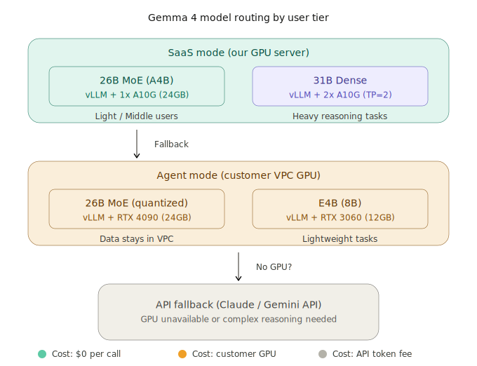

# Architecture — 4-Layer Workflow Automation Engine

> 프로젝트 전체 구조의 단일 진입점. 세부는 각 브랜치 `CLAUDE.md`로 분기.

## 레이어 개요

```
┌─────────────────────────────────────────────────────────┐
│  Frontend Layer  (Next.js + React Flow)                 │
│  - 노드 기반 워크플로우 에디터 UI                         │
│  - WebSocket으로 실행 상태 실시간 구독                    │
└────────────────────────┬────────────────────────────────┘
                         │ REST + WebSocket
┌────────────────────────▼────────────────────────────────┐
│  Core Layer  (FastAPI / API_Server)                     │
│  - 워크플로우 CRUD, DAG 스케줄링, 트리거 감시              │
│  - Execution_Engine 및 Agent 디스패치 조율                │
└──────────┬──────────────────────────────┬───────────────┘
           │ Celery 큐                     │ WebSocket
┌──────────▼──────────────┐   ┌───────────▼───────────────┐
│ Serverless Worker       │   │ Agent (고객 VPC)            │
│ (Cloud Run + Celery)    │   │ - Heavy 유저용 전용 실행기    │
│ - Light/Middle 유저용    │   │ - 외부 반입 불가 데이터 처리  │
└──────────┬──────────────┘   └───────────┬───────────────┘
           │                               │
┌──────────▼───────────────────────────────▼───────────────┐
│  Data Layer  (PostgreSQL 16 + Redis)                     │
│  - Repository 패턴으로 추상화, 직접 SQL 금지               │
│  - 자격증명 AES-256(Fernet) 암호화 저장                   │
└──────────────────────────────────────────────────────────┘
```

## 브랜치 ↔ 레이어 매핑

| 레이어 | 브랜치 | 세부 지침 |
|--------|--------|-----------|
| Frontend | `Frontend` | [`_claude_templates/CLAUDE_Frontend.md`](../../_claude_templates/CLAUDE_Frontend.md) |
| Core | `API_Server` | [`_claude_templates/CLAUDE_API_Server.md`](../../_claude_templates/CLAUDE_API_Server.md) |
| Execution | `Execution_Engine` | [`_claude_templates/CLAUDE_Execution_Engine.md`](../../_claude_templates/CLAUDE_Execution_Engine.md) |
| Data | `Database` | [`_claude_templates/CLAUDE_Database.md`](../../_claude_templates/CLAUDE_Database.md) |
| Inference | `Inference_Service` *(신설 예정)* | vLLM + Gemma 4 서빙. 템플릿은 후속 작업. |
| Wiki (본 문서군) | `docs` | [`_claude_templates/CLAUDE_docs.md`](../../_claude_templates/CLAUDE_docs.md) |

## 실행 모드 (하이브리드 SaaS)

두 가지 실행 경로를 `workflow.settings.execution_mode`로 분기한다:

- **`serverless`** — Light/Middle 유저. Celery → Redis 큐 → Cloud Run 컨테이너.
- **`agent`** — Heavy 유저. 고객 VPC에 설치된 Agent가 WebSocket으로 서버와 상시 연결, 서버가 `execute` 명령을 push.

동일한 `BaseNode` 플러그인 인터페이스와 `NodeRegistry`를 두 모드가 공유한다.

## 주요 데이터 흐름

### 1. 워크플로우 생성/실행 (Serverless)
```
Frontend ──POST /api/v1/workflows──▶ API_Server
                                      │
                                      ├─▶ DAGScheduler (Kahn 위상정렬 + 순환 검사)
                                      ├─▶ WorkflowRepository.save (Database)
                                      └─▶ Celery.enqueue → Worker (Execution_Engine)
                                              │
                                              ├─ CredentialStore.retrieve (실행 시점만)
                                              ├─ Node.execute (병렬: asyncio.gather)
                                              └─ ExecutionRepository.save_result
```

### 2. Agent 모드 실행
```
Agent ──WebSocket register──▶ API_Server  (agent_key → JWT)
Agent ──heartbeat (10~30s)──▶ API_Server

Trigger fires → API_Server ──execute(AgentCommand)──▶ Agent
                                                       │
                                                       ├─ RSA 복호화 (자격증명)
                                                       ├─ Node.execute (VPC 내부)
                                                       └─ status_update / execution_result
                                                          (메타데이터만, 원본 데이터 VPC 잔류)
```

### 3. Webhook 트리거
```
외부 서비스 ──POST /webhooks/{workflow_id}/{path}──▶ API_Server
                (HMAC 서명 검증)                      │
                                                      └─▶ 실행 디스패치 (위 1 또는 2)
```

## LLM 추론 계층 (Inference Layer)

LLM 추론은 `Execution_Engine`이 아닌 **독립 레이어 `Inference_Service`** 가 담당한다.
도입 배경과 결정 상세는 [`decisions.md` ADR-008](./decisions.md) 참조.



### 플랜별 백엔드 라우팅

| 플랜 | 백엔드 | 모델 |
|------|--------|------|
| Light | 외부 API | Claude / Gemini |
| Middle | 외부 API (공유 풀) | Claude / Gemini |
| Heavy (Serverless) | **중앙 `Inference_Service`** | Gemma 4 26B MoE / 31B Dense (fp8) |
| Heavy (Agent) | Agent 내 vLLM (E4B) — **Phase 2** | Phase 1은 중앙 경유 또는 API |

라우팅은 유저 플랜으로 **고정**된다. 런타임 복잡도 판정으로 백엔드를 바꾸지 않는다 (ADR-008).

### 폴백 규칙 (플랜 무관, 운영 안전망)

1. 로컬 모델 `output_schema` 검증 N회 연속 실패 → 더 큰 로컬 모델로 재시도(26B → 31B)
2. 로컬 인프라 장애(전체) → 외부 API로 폴백 + 장애 알람

### 호출 흐름

```
Execution_Engine / LlmNode
        │
        ├─ 유저 플랜 조회 (API_Server 경유)
        │
        ├─ Light/Middle → 외부 API 어댑터 (OpenAI/Anthropic/Gemini)
        │
        └─ Heavy (Serverless) → HTTP POST /v1/chat/completions
                                 (OpenAI 호환 엔드포인트)
                                 │
                                 ▼
                        Inference_Service
                        (vLLM + Gemma 4)
                        │
                        ├─ structured output 네이티브 지원 (tool_call_parser=gemma4)
                        └─ 응답 → LlmNode output_schema 검증
```

## AI / LLM 노드 설계 원칙

LLM 노드는 `HttpRequestNode` 파생이 아니라 **1급 추상화 `LlmNode`** 로 분리한다.
배경과 결정은 [`decisions.md` ADR-007](./decisions.md) 참조.

핵심 규칙:

1. **Structured Output 강제** — 모든 노드가 `output_schema`(JSON Schema 문자열)를 선언할 수 있으며, `LlmNode`는 이를 **필수**로 요구한다. 런타임이 결과를 검증하고 실패 시 재시도(기본 2회) → 그래도 실패면 구조적 실패로 기록.
2. **역할 축소** — LLM 노드는 "추출 / 분류 / 요약 / 변환" 같은 단일 작업으로 한정. 복합 판단은 여러 `LlmNode` + `ConditionNode` 조합으로 분해. (규범적 가이드)
3. **Human-in-the-loop (`ApprovalNode`)** — 워크플로우 중간에 실행을 일시정지하고 사람의 승인을 기다리는 1급 노드. **웹 인박스 + 알림(이메일/Slack)** 두 경로 동시 제공이 MVP 범위.
4. **비용/지연 관측성** — 실행 이력에 `token_usage`, `cost_usd`, `duration_ms`, `paused_at_node` 누적.

### Approval 흐름 (요약)

```
DAG 실행 … → ApprovalNode
              │
              ├─ 실행 상태 = paused, paused_at_node = N
              ├─ NotificationChannel.send (email + slack)
              │     │
              │     └─ 메시지 내 링크: /approve/{execution_id}
              │
              └─ 대기 … (분~일 단위)
                    │
                    ▼
           사용자 액션 (웹 인박스 또는 알림 링크)
                    │
              POST /api/v1/executions/{id}/approve | reject
                    │
                    ▼
           런타임 재개 (멱등): 후속 노드 실행 또는 실패 분기
```

Approval 수명주기는 ADR-005의 30초 하드 타임아웃과 **분리**된다 — 코드 노드 샌드박스 타임아웃은 그대로 유지하되, paused 실행은 만료 없는 별도 상태로 관리.

## 플러그인 확장 포인트

- **새 노드 추가**: `Execution_Engine/src/nodes/` 에 `BaseNode` 상속 클래스 작성 → `registry.register()` → `tests/nodes/test_{name}.py` 필수
- **새 Repository 구현**: `Database/src/repositories/` 에 ABC 구현, 테스트에서 `InMemoryXxxRepository`로 대체 가능해야 함

## 관련 문서

- 설계 결정 배경: [`decisions.md`](./decisions.md)
- 파일/디렉토리 맵: [`MAP.md`](./MAP.md)
