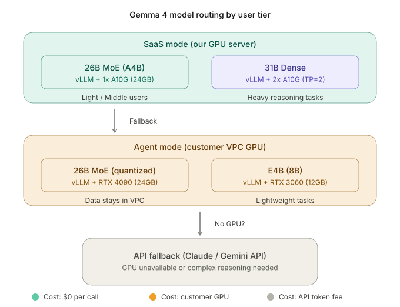

# Architecture Decision Records (ADR)

> Single source of truth for "why we made this choice." When a decision changes, add a new entry and mark the prior entry *Superseded*.

Format: `ADR-###` / Status / Date / Context → Decision → Consequences.

---

## ADR-001 — Hybrid SaaS (Serverless + Agent)

**Status**: Accepted · **Date**: 2026-04-14

**Context**
Building an n8n-style workflow automation SaaS. Users split into two segments:
- Light/Middle: hundreds to a few thousand executions per month. Cost-sensitive.
- Heavy: customer VPC holds sensitive data (PII, revenue DBs, etc.) that cannot leave their boundary. Subject to regulation.

**Decision**
Instead of a single execution path, branch on `workflow.settings.execution_mode`:
1. `serverless` — Celery + Redis + Cloud Run. Multi-tenant.
2. `agent` — Lightweight Agent daemon installed inside the customer VPC, kept on a persistent WebSocket to the central server. The server only pushes `execute` commands; data stays inside the VPC.

Both paths share the same `BaseNode` plugin interface so node implementations remain a single codebase.

**Consequences**
- (+) Resolves Heavy users' data-egress concern; satisfies regulatory needs
- (+) Light users covered at serverless unit costs (~$0.04–$0.81/month)
- (−) Adds an Agent build / distribution / version-management pipeline
- (−) Integration test coverage burden across both paths

**Update (2026-04-15)** — API_Server PLAN_02 fixed **per-plan workflow quotas** as below:

| Plan | Active workflow cap | Warning trigger (`approaching_limit`) |
|------|---------------------|---------------------------------------|
| light | **100** | 90+ (90%) |
| middle | **200** | 180+ (90%) |
| heavy | **500** | 450+ (90%) |

- Quotas count only `is_active=true` rows. Soft-deleted workflows are excluded
  → repeated create/delete by a user does not accumulate (DB bloat is handled
  by a separate retention policy).
- When the cap is reached, `POST /workflows` returns **403 Forbidden**:
  `"workflow limit reached: N workflows for <tier> tier (plan upgrade available)"`
- `approaching_limit=true` is included in `GET /workflows` responses so the
  frontend can surface a warning banner without an extra API call.
- Values are overridable via env vars on `Settings` in
  `API_Server/app/config.py` (e.g., `WORKFLOW_LIMIT_LIGHT=150`) so ops can
  reflect business decisions without redeploying code.
- **Rationale**: unbounded creation would inflate the operational DB and
  scale up scheduler/trigger-manager runtime cost without limit. Per-plan
  differentiation enforces the pricing tier structure at the technical layer.
- In Phase 2, when org-level quotas are added, retain these values as the
  **per-user defaults** and add the org quota as a higher layer.

---

## ADR-002 — Backend: Python/FastAPI (not Node.js)

**Status**: Accepted · **Date**: 2026-04-14

**Context**
n8n is Node.js based. Decide whether to inherit the same stack or pick a different one.

**Decision**
FastAPI (async) + SQLAlchemy 2.0 async + asyncpg + Celery.

**Consequences**
- (+) Aligns with team expertise (Python)
- (+) Leverages the Python ecosystem for sandboxing (RestrictedPython), data processing, ML integration
- (+) FastAPI async fits naturally with WebSocket (Agent connection)
- (−) Cannot directly reuse n8n community nodes (need re-implementation)

---

## ADR-003 — Task queue: Celery (not BullMQ/Dramatiq)

**Status**: Accepted · **Date**: 2026-04-14

**Context**
After fixing on Python (ADR-002), pick a distributed task queue.

**Decision**
Celery + Redis. Cloud Run workers for horizontal scale.

**Consequences**
- (+) Mature, rich features (retries, periodic, routing, etc.)
- (+) Redis doubles as result backend and queue
- (−) Configuration complexity. Need Celery eager mode to keep tests simple

---

## ADR-004 — Credential encryption: Fernet (AES-256) + RSA re-encryption

**Status**: Accepted · **Date**: 2026-04-14

**Context**
Credentials have two lifecycles: DB storage and Agent transmission. The threat models for storage and transmission differ.

**Decision**
- **Storage**: `cryptography.fernet.Fernet` (AES-256-CBC + HMAC). Master key in env var `CREDENTIAL_MASTER_KEY`.
- **Agent transmission**: *Re-encrypt* with the RSA public key received at Agent registration time. Only the Agent can decrypt.
- **At execution time**: Decrypt only inside Worker/Agent memory, inject as node parameters, then discard immediately. Plaintext is strictly forbidden in logs / DB / responses.

**Consequences**
- (+) Independent key isolation across the storage and transmission layers
- (+) Even if the central server is compromised, in-flight credentials to the Agent are protected solely by the public key → reduced blast radius
- (−) Need a per-Agent keypair generation/rotation policy (still TBD — subject of a follow-up ADR)

---

## ADR-005 — User code execution: RestrictedPython + Docker, two-layer isolation

**Status**: Accepted · **Date**: 2026-04-14

**Context**
`CodeExecutionNode` runs Python code authored by the user. Direct use of `eval`/`exec` is an obvious RCE.

**Decision**
First layer (AST defense): `RestrictedPython.compile_restricted` + builtin function whitelist
Second layer (process defense): execution inside an isolated Docker container (network/FS restrictions)
Timeout: 30s hard limit by default

**Consequences**
- (+) If one defense is bypassed, the second still holds
- (−) Docker startup overhead (~hundreds of ms). Frequently invoked nodes need a fast path

---

## ADR-006 — Repository pattern + ABC

**Status**: Accepted · **Date**: 2026-04-14

**Context**
If `API_Server` and `Execution_Engine` depend directly on the DB, tests need a real DB and coupling rises.

**Decision**
The `Database/` branch provides ABCs (`WorkflowRepository`, `ExecutionRepository`, `CredentialStore`) plus a Postgres implementation. Upper layers depend only on the ABCs. Tests substitute `InMemoryXxxRepository`.

**Consequences**
- (+) No DB needed in unit tests
- (+) Future store swaps (e.g., CockroachDB) require swapping only the implementation
- (−) Interface design / maintenance overhead

---

## ADR-007 — LLM node as a first-class abstraction + enforced output schema + built-in human-in-the-loop

**Status**: Accepted · **Date**: 2026-04-14 · *Refined by ADR-008 (narrowed structured-output adapter scope), ADR-011 (separate execution log storage)*

**Context**

In practice, AI usage in tools like n8n repeatedly hits three limits:

1. **Output instability** — The LLM node returns different shapes (JSON / plaintext / variant key names) for the same input, breaking downstream parsing. The "predictable repetition" essence of automation fundamentally collides with LLM non-determinism.
2. **Sharp drop in compound-judgment accuracy** — Handing tasks like "rate contract risk clauses by the legal team's standards" to a single node causes hallucination rates above acceptable thresholds. Result: "we automated it but reviewing made the workload heavier."
3. **Cost / latency** — Chaining 3–4 LLM-call nodes accumulates tens of seconds + token cost per execution, making automation economically unviable for thousands of daily jobs.

Our current design has no LLM-specific abstraction. Calling APIs through `HttpRequestNode` puts us in the same structure n8n is criticized for — and exposes us to the same limits.

**Decision**

Build the following into the Execution Layer **as engine defaults**.

1. **`BaseNode.output_schema` (universal)**
   Any node may declare a **JSON Schema string** optionally; the runtime validates the result of `execute()`. For LLM nodes, this is **mandatory**. On validation failure, `NodeRetryPolicy` (default: max 2 retries, exponential backoff) retries; all retries failing is recorded as a structural failure.
   Fixing on a JSON Schema string is required because a workflow is serialized to JSON and stored / restored in the `workflows` table; the schema must travel **with the data** through that lifecycle. Pydantic model objects bind to the Python runtime, serialize poorly, and conflict with the frontend schema-edit UI. We prioritize system stability (lossless serialization round-trips) over typing convenience.

2. **`LlmNode` first-class subclass**
   Its own abstraction, not a `HttpRequestNode` derivative. Attributes: `prompt_template`, `output_schema` (required), `model`, `temperature`, `max_retries`.
   If the model supports structured output (JSON mode, tool use), prefer that path; for unsupported models, fall back to "JSON-forced prompt + validation loop." Per-model spec differences (OpenAI tool use / Anthropic tool use / Gemini responseSchema) are absorbed by an adapter layer.

3. **`ApprovalNode` — web approval + notification, two-track default**
   Pauses execution at a specific node and waits for human approval. **MVP provides both paths in parallel**:
   - **Web path**: surfaces in the frontend "Approval Inbox," resumed by `POST /api/v1/executions/{id}/approve | reject` endpoints.
   - **Notification path**: while pending, sends email/Slack (later mobile push) to the user; the action link in the message hits the same endpoint.

   Both paths in MVP scope because the real-world UX assumption is "the user does not keep the workflow UI open at all times." With only a web inbox and no notifications, approval delays would stall executions indefinitely and `ApprovalNode` would go unused. Notification channels are abstracted via the `NotificationChannel` interface; the initial implementation is limited to email + Slack.

   The DAG runtime stores a state machine (`running` → `paused` → `resumed`/`rejected`) and processes resume commands idempotently. Approval wait time can be minutes to days, so it is managed as a **separate lifecycle** from the existing 30-second hard timeout (ADR-005).

4. **Node role narrowing guideline (policy)**
   Recommend limiting LLM node responsibility to a single task: "extract / classify / summarize / transform." Compound judgment should be decomposed into multiple `LlmNode` + `ConditionNode` combinations — reflected in UI guidance and templates. No technical enforcement; normative guideline only.

Observability additions (incidental):
- Add `token_usage`, `cost_usd`, `duration_ms`, `paused_at_node` columns to the `executions` table.
- `ExecutionRepository.save_result` accumulates LLM call metadata.

**Consequences**

- (+) **Structural response** to the three field complaints (instability / accuracy / cost visibility). Corrects the "LLMs cannot be trusted" premise at the engine level.
- (+) `output_schema` validation reuses for HTTP/DB response validation, not just LLM → universal reliability gain.
- (+) Schema is included in workflow JSON serialization → lossless across DB round trips / version migrations / external exports.
- (+) The Approval two-track realistically supports a "95% auto + 5% review" rollout model, lowering early-adoption resistance.
- (−) **Runtime complexity jumps**. The DAG executor must manage a state machine and guarantee idempotent resume on both Celery and Agent.
- (−) **DB schema change** required (one migration). The Repository contract from ADR-006 expands.
- (−) **`LlmNode` is hard to implement**: needs a per-model structured-output adapter layer.
- (−) **Notification infrastructure dependency** added. SMTP/Slack send failures may translate to perceived service outages, requiring retry / fallback paths.
- (−) JSON Schema strings are awkward for developers to handle directly as types → mitigated internally by `jsonschema` library validation + a runtime Pydantic conversion helper.

**Update (2026-04-15) — DB persistence of node `running` state**

The original Decision only surfaced "which node it paused on during approval wait" via `executions.paused_at_node`. A subsequent frontend UX review surfaced the requirement "during normal execution too, the user wants to see how far it got (a progress animation, not a loading spinner)" — so we extend the observability layer:

- The instant a node **starts**, INSERT a row with `status='running'` into `execution_node_logs`. On completion UPDATE the same row to `'success'|'failed'|'skipped'`.
- The concrete schema and partitioning of this 2-phase write path are defined in **ADR-011**.
- The frontend reads this table by polling/streaming and renders per-node progress.
- The `ApprovalNode` `paused` transition also goes through the same table — Approval is consistently treated as "a special case of a running node waiting on human input."

**Related**
- Refines: ADR-006 (extends the Repository contract)
- Refined by: ADR-011 (separate execution-log storage / partitioning / 2-phase write)
- Interacts with: ADR-005 (the 30s code-node timeout is separate from the Approval/LLM lifecycle)
- Affects branches: `Execution_Engine` (runtime / LlmNode / ApprovalNode), `Database` (schema), `API_Server` (approval endpoints, resume dispatch, notification dispatch), `Frontend` (schema edit UI, approval inbox, execution progress animation)

---

## ADR-008 — Local LLM serving: Gemma 4 + vLLM, plan-based routing, separate Inference_Service branch

**Status**: Accepted · **Date**: 2026-04-14 · *Refined by ADR-009 (Agent-mode CPU-only path)*



**Context**

ADR-007 structurally addressed the LLM node's output stability and human-in-the-loop problems, but the third limit — **cost and latency** — still depends on external APIs. Assuming 3–4 AI node calls per workflow × thousands of executions per day:

- API approach: Heavy users incur ~$50–200/month variable cost. Proportional to call count.
- Additional burden: network RTT, API rate limits, B2B resistance to customer data leaving the boundary.

At the same time, Google released **Gemma 4** under Apache 2.0. The model lineup matches our 3-tier user segmentation exactly:

- **26B MoE (4B active)**: 4B-class latency + 26B-class quality. Workhorse for general AI nodes (classify / summarize / extract).
- **31B Dense**: heavy reasoning.
- **E4B**: for Agent / edge GPU.

Gemma 4 supports **native function-calling + structured output**. vLLM enables it immediately via `--tool-call-parser gemma4`. vLLM benchmarks show 3× TTFT and 3× throughput vs. Ollama; the 26B MoE hits 131 tok/s, faster than the E4B (124 tok/s) — MoE effect.

**Decision**

1. **Adopt local LLM serving** — vLLM + Gemma 4 as the workflow engine's default LLM backend.
   - Default model: **26B MoE** (general nodes)
   - Heavy model: **31B Dense** (complex reasoning; add a separate instance on demand initially)
   - Quantization: **fp8** (assuming GCP RTX 6000 Pro 24–48GB class)
   - Serving options: `--enable-auto-tool-choice --tool-call-parser gemma4`

2. **Routing policy: plan-based fixed (Option C)**
   Consistent with the 3-tier user segmentation in ADR-001, **the user's plan determines the backend**. We do not introduce runtime complexity assessment or threshold-based auto-switching.

   | Plan | LLM backend | Notes |
   |------|-------------|-------|
   | Light | External API (Claude/Gemini) | Low call volume. Avoids fixed cost. |
   | Middle | External API (shared pool) | Re-evaluate moving to local in Phase 2 if usage grows |
   | Heavy (Serverless) | **Central vLLM serving** (Gemma 4 26B MoE / 31B) | Above the breakeven point |
   | Heavy (Agent) | In-Agent vLLM (E4B) — **Phase 2** | MVP routes through central vLLM or API |

   **Failure-fallback rules** (common to all plans):
   - When a local model fails `output_schema` validation N consecutive times → retry within the same plan with the larger local model (26B → 31B)
   - Total local infra outage → fall back to external API regardless of plan, plus an outage alarm
   - Fallback is an operational safety net, not a routing policy.

3. **New `Inference_Service` branch**
   Separate vLLM serving from `Execution_Engine` into its **own layer**.
   - Different deploy/scale lifecycle (GPU instances, multi-minute model load vs. sub-second worker spin-up)
   - GPU pre-allocate ~90 GB pressure makes a dedicated instance natural
   - Responsibility separation: `Execution_Engine` runs nodes; `Inference_Service` serves models. Independent swap / upgrade.
   - Interface: `LlmNode` in `Execution_Engine` calls `Inference_Service` over HTTP. Simplified via the OpenAI-compatible endpoint (vLLM default).

4. **In-Agent vLLM (E4B) deferred to Phase 2**
   Embedding E4B serving in the Heavy user's VPC Agent would maximize the ADR-001 hybrid-SaaS advantage ("data + inference both stay in the VPC"), but it is out of MVP scope:
   - Bundling GPU runtime + vLLM + tens-of-GB model weights into the Agent image explodes deployment complexity
   - GPU presence cannot be assumed even for Heavy users
   - In Phase 1 the Agent calls the central `Inference_Service` (VPC → central) or falls back to an external API. For data-sensitive customers, offer a "no API fallback" option until Phase 2.

5. **Narrowed ADR-007 adapter scope**
   On paths where Gemma 4's native structured output is available, the "JSON-forced prompt + validation loop" fallback is unnecessary. Narrow ADR-007 Decision 2's adapter layer to "structured-output unsupported paths only." We do not edit the body of ADR-007; only annotate its status line with *Refined by ADR-008* (ADR immutability principle).

**Consequences**

- (+) **Sharp drop in Heavy user unit cost**: above ~50K monthly calls, per-call cost is tens of times lower than the API
- (+) **Stronger data boundary**: with central vLLM serving, B2B data never traverses an external API provider (VPC residency is Phase 2)
- (+) **Native function-calling**: ADR-007's `output_schema` enforcement is supported directly by the model → reduced adapter burden
- (+) **Responsibility separation**: independent `Inference_Service` lets us scale GPU and upgrade models without touching the Execution layer
- (−) **Switch to fixed cost**: at the early-user stage, ~$300–500/month GPU instances are sunk cost. There is an early window where Light/Middle API revenue does not offset it
- (−) **Operational complexity**: GPU instance health checks, model load time, OOM, pre-allocate ~90 GB management
- (−) **Fallback path testing burden**: the local-failure → API fallback path activates rarely, so periodic canaries are needed
- (−) **Follow-up work needed**: post-checkout hook case branch + `_claude_templates/CLAUDE_Inference_Service.md` template (out of scope for this ADR; handled in main)

**Related**
- Extends: ADR-007 (LLM node first-class abstraction) — Gemma 4 native structured output narrows the adapter scope
- Interacts with: ADR-001 (Hybrid SaaS) — Agent + vLLM synergy is Phase 2
- Affects branches: `Inference_Service` (new), `Execution_Engine` (`LlmNode` depends on the HTTP client), `API_Server` (plan-based routing decision), `Database` (user-plan field)

---

## ADR-009 — Agent-mode CPU-only customer support: KTransformers as a second backend in Inference_Service

**Status**: Proposed · **Date**: 2026-04-14

**Context**

ADR-008 solved Heavy users' cost / latency / data-boundary problems via the central `Inference_Service` (vLLM + Gemma 4), but in the **Agent mode = execution inside the customer VPC** scenario, one premise breaks: *that the customer owns a GPU*. B2B sales conversations have surfaced these patterns:

- Even Heavy users frequently have **CPU-only servers** in-house (especially financial / public sector / manufacturing on-prem).
- Some customers have **organizationally banned external-API fallback** because of data sensitivity.
- That is, both ADR-008 Agent fallback paths (call central vLLM, or external API) are **blocked** for a segment of customers.

Around the same time, **KTransformers** (MADSys @ Tsinghua) drew attention. It is often compared with vLLM but **solves a different problem**:

| Axis | vLLM | KTransformers |
|---|---|---|
| Optimization target | When GPU is plentiful, **concurrent request throughput** (PagedAttention + continuous batching) | When GPU is scarce, **CPU-GPU heterogeneous** execution to run very large models |
| Strong scenario | Multi-user SaaS serving | Single / few users, no GPU or ≤24GB |
| Reported performance | ~50–200× concurrency vs. plain Transformer on A100 | prefill 4.62–19.74×, decode 1.25–4.09× (vs. existing CPU offloading); runs 671B parameters on a single 24GB-VRAM GPU; prefill up to 286 tok/s |
| Hardware assumption | NVIDIA GPUs (excellent at multi-GPU tensor/data parallel) | Best on AMD EPYC + AMX-capable CPUs + at least 16GB CUDA GPU |
| API surface | OpenAI-compatible (immediately usable) | Research-flavored; no OpenAI-compatible surface (SGLang integration PR in progress) |
| Maturity | Many production validations | `kt-kernel` / `kt-sft` recently refactored; few production references |

**Key insight**: KTransformers is **complementary to**, not a replacement for, vLLM. In SaaS mode (central serving), vLLM is the answer; KTransformers fills the **gap of "Agent customers without a GPU."**

**Decision**

1. **Add KTransformers as a second backend in `Inference_Service`.**
   - Keep vLLM as the first choice (central serving + Agent with GPU).
   - Use KTransformers as a path for **Agent-mode customers without (or short on) a GPU**.
   - Both backends must look identical to `LlmNode` — the same OpenAI-compatible interface. Since KTransformers does not yet expose an OpenAI-compatible endpoint, wrap it with an **`Inference_Service` internal adapter**.

2. **Centralize routing in a single LLMRouter** (runtime branching, layered above plan branching).

   ```python
   class LLMRouter:
       async def route(self, execution_mode: str, gpu_info: dict) -> LLMProvider:
           if execution_mode == "serverless":
               # SaaS mode → always vLLM (concurrency is the priority)
               return self._vllm_central

           # Agent mode → branch on customer hardware
           if gpu_info["vram_gb"] >= 24:
               return self._agent_vllm           # GPU sufficient → vLLM
           elif gpu_info["cpu_supports_amx"]:
               return self._agent_ktransformers  # GPU short + AMX CPU → KTransformers
           else:
               return self._api_fallback         # If neither → external API (when org policy permits)
   ```

   - `gpu_info` is collected once at Agent boot and registered with `API_Server`. Not re-detected per execution.
   - For customers whose org policy bans external-API fallback, an empty routing result results in **node execution failure** (no infinite-fallback loops).

3. **Not adopted in MVP — separated into the Phase 2 roadmap.**
   Same conservative posture as ADR-008. Reasons:
   - KTransformers has no OpenAI-compatible API, so adapter authoring incurs cost.
   - Hardware compatibility is narrow (AMD EPYC + AMX). Customer environment surveys are required.
   - Production stability validation is weaker than vLLM → MVP reliability risk.
   - For the MVP, Agent mode is sufficient via *central `Inference_Service` or external API* per ADR-008.

4. **Phase 2 entry triggers**: implementation begins when one of the following is satisfied.
   - **Two or more** Heavy customer prospects matching "no GPU + external-API banned" appear in the sales pipeline
   - The KTransformers SGLang integration PR merges, stabilizing the OpenAI-compatible surface

**Consequences**

- (+) **Filling the gap**: explicit response path for ADR-008's blind spot (no-GPU Agent customer + external-API banned). In sales, we can answer "supported in Phase 2" instead of "we cannot serve them."
- (+) **Routing consistency**: `LLMRouter` absorbs backend variety, so `LlmNode` code is unchanged. No conflict with ADR-007's first-class abstraction.
- (+) **MVP scope protection**: Phase 2 separation has no impact on MVP schedule / reliability. Same pattern as ADR-008's conservative fallback strategy.
- (−) **Pre-survey burden**: for each Agent customer, sales/onboarding must collect three things — `gpu_info`, AMX support, and org policy on external APIs. Requires CRM or onboarding-checklist additions.
- (−) **Second adapter maintenance cost**: until KTransformers' OpenAI-compatible surface stabilizes, we directly maintain the `Inference_Service` internal adapter. Once SGLang integration merges, we can remove or thin out the adapter.
- (−) **Operational matrix expansion**: have to manage health checks / model load / version compatibility for both vLLM and KTransformers. Limited to the Agent side, so central-serving operational burden does not grow.

**Update (2026-04-15) — `external_api_policy` implementation contract**

Defines the concrete data shape that the routing code in `API_Server` must read for the Decision §2 clause "for customers whose org policy bans external-API fallback, an empty routing result results in node execution failure."

- Storage location: `users.external_api_policy` (JSONB, PLAN_01 §3.1)
- **Sole contract key**: `allow_outbound: boolean`
  - `true` — allow external API fallback
  - `false` (default, missing) — ban external API fallback → empty routing → node execution failure
- **Forward-compat rule**: undefined keys are stored but ignored on read with a `WARN` log.
  This ADR fixes only the single key `allow_outbound`; extension keys (e.g., domain allow / deny lists) are added in a separate PLAN once the gating logic actually needs them.
- Change history: when adding/removing this key, record it in this ADR's Update section as a table.

This contract becomes the single source for whether the `_api_fallback` branch in `Inference_Service`'s `LLMRouter` (Decision §2) activates.

**Related**
- Refines: ADR-008 (Gemma 4 + vLLM local serving) — augments the Agent-mode backend path
- Interacts with: ADR-001 (Hybrid SaaS) — covers the no-GPU variant of "data + inference both stay in the VPC"
- Affects branches: `Inference_Service` (KTransformers adapter, Phase 2), `API_Server` (Agent `gpu_info` / policy field, `external_api_policy` read path), `Database` (customer environment metadata, `users.external_api_policy`, `agents.gpu_info`)
- Open questions: KTransformers' Gemma 4 26B MoE support validation, performance floor on non-AMX CPUs, license re-review (Apache 2.0 compatibility)

---

## ADR-010 — Pre-load pgvector extension in MVP

**Status**: Accepted · **Date**: 2026-04-15

**Context**

During Database branch MVP bootstrap, we discussed: "we have no use case requiring a vector column today, but RAG (natural language → node generation, template / past-workflow search) might come later." Two options:

1. Start with stock `postgres:16` and switch to a pgvector docker image with `CREATE EXTENSION vector` migration when RAG is needed
2. Use `pgvector/pgvector:pg16` from the start and install the extension by default

**Decision**

**Option 2 chosen**. `Database/docker-compose.yml` image is `pgvector/pgvector:pg16`, and `schemas/001_core.sql` includes `CREATE EXTENSION IF NOT EXISTS "vector"`. The MVP schema has no vector columns yet — install the extension and wait for the use point.

**Rationale**

- **Asymmetric switching cost**: future swap requires a docker image change + restart + extension install migration, which is non-trivial on an operational DB. Installing now means RAG adoption ends with "one migration line + column add."
- **Pre-load cost**: image size differs by tens of MB. Runtime overhead of an installed but unused extension is 0. So the present cost is **near 0** and future cost avoidance is large.
- **YAGNI exception criterion**: rejecting a zero-cost option as YAGNI creates technical debt. YAGNI applies to "features that grow complexity," not "zero-cost foundational infrastructure."

**Consequences**

- (+) Subsequent PLANs (e.g., PLAN_06 RAG) skip extension install steps → a single migration runs `ALTER TABLE ... ADD COLUMN embedding vector(N)`.
- (+) Reduced data migration risk — installing extensions on operational DBs has restart/lock issues that need a separate ops window; absorbed at MVP stage.
- (−) Docker image is fixed to a `pgvector` variant. Reverting to the stock image requires docker reconfiguration (reverse cost is also small).
- (−) If the extension stays "installed but unused" for a long time, teammates may get confused ("I thought we used it — why don't we?"). Mitigated by stating the state explicitly in this ADR.

**Related**
- Enables: future RAG PLANs (template gallery / user-workflow embedding search)
- Affects branches: `Database` (DDL / docker image)

---

## ADR-011 — Separate execution-log storage + monthly partitioning + GCS payload offload

**Status**: Accepted · **Date**: 2026-04-15

**Context**

The `executions.node_results jsonb` introduced in ADR-006/007 started as "per-node result summary," but the actual data accumulating there faces three pressures:

1. **ADR-007 observability requirements** — per-node `token_usage` / `cost_usd` / `duration_ms` + Approval state machine. Aggregating LLM usage by model requires scanning inside the JSONB, and that does not perform.
2. **Retry history** — when a node retries N times, JSONB keys collide. Either "only the latest result is visible and past attempts are lost" or a deeply nested structure forms. Both hurt UX/debugging.
3. **UI animation requirements (ADR-007 Update 2026-04-15)** — users want to see "completed up to node N, executing node N+1," not a "loading icon." This means a record must exist in the DB while a node is `running`.
4. **stdout/stderr payload size** — custom-script nodes can emit MB-scale output. Embedding that in JSONB inflates rows and degrades whole-table I/O.
5. **Partitioning tech-debt trap** — "let's add partitioning to the log table later" is a well-known debt trap. Adopting partitioning on an operational DB carries lock / rewrite risk.

**Decision**

Promote the separate-storage structure implemented in PLAN_03 to a design decision:

1. **New table `execution_node_logs` — monthly RANGE partitioning**
   - Partition key: `started_at` (timestamptz)
   - PK: `(id, started_at)` — Postgres native partitioning requires UNIQUE constraints to include the partition key
   - Bootstrap 12 monthly partitions in a DDL `DO` block
   - `scripts/roll_partitions.py` rolls forward monthly (external scheduler responsibility)
   - Retention/deletion policy is decided in a **separate ops PLAN** — out of scope for this ADR

2. **Role separation from `executions.node_results` (Option A)**
   - `executions.node_results` = **only the latest attempt summary**. Retain `API_Server`'s existing contract (`append_node_result`).
   - `execution_node_logs` = **sole source of detailed logs**. Retry/running/completion all stack here as N rows.
   - `Execution_Engine` writes to **both Repositories** during node execution.

3. **2-phase write (`record_start` / `record_finish`)**
   - On node start → `record_start` INSERTs a `status='running'` row
   - On node end → UPDATE the same row (`success|failed|skipped`)
   - Partition key `started_at` is **immutable** → UPDATE does not move rows across partitions
   - The UPDATE WHERE clause must specify both `(id, started_at)` (with `id` alone, Postgres scans every partition — partition pruning fails)

4. **`attempt` is passed explicitly by the caller**
   - 1-based integer, DEFAULT 1 is happy-path convenience only
   - The retry loop in `Execution_Engine` owns the counter and passes it explicitly to each `record_start`
   - No DB-side auto-increment (avoids race-defense complexity)

5. **Promote four LLM observability fields to columns**
   - `model text`, `tokens_prompt int`, `tokens_completion int`, `cost_usd numeric(10,6)` — first-class columns, not JSONB
   - Partial index `(model) WHERE model IS NOT NULL` for per-model aggregation query path
   - Other per-node detailed metadata stays in `input/output/error jsonb` fields

6. **stdout/stderr offloaded to GCS — DB only stores URI pointers**
   - `stdout_uri text NULL`, `stderr_uri text NULL`
   - Recommended format: `gs://{bucket}/executions/{execution_id}/{node_id}/{attempt}/stdout.log`
   - GCS uploader implementation is `Execution_Engine`'s responsibility. The DB branch does not validate URI format.
   - Security effect: reduces the risk of sensitive payloads mixing into DB backups/dumps.

**Consequences**

- (+) LLM usage aggregation runs at O(partition pruning) speed with partial indexes + first-class columns.
- (+) Partitioning is applied **from the start**, removing the future no-partition → partitioned migration risk.
- (+) The 2-phase write enables real-time frontend progress animation. State model is consistent with `ApprovalNode` (paused is a special case of running).
- (+) stdout/stderr does not bloat DB rows. Large node output does not hurt DB performance. Backup/replication cost decreases.
- (+) `Execution_Engine`'s retry loop owns `attempt` → the DB does not need two sources of truth. No race-defense complexity.
- (−) `Execution_Engine` must call both Repositories — missed calls produce "summary present but detail missing" or vice versa. Wrap with a call wrapper / decorator.
- (−) GCS dependency added to `Execution_Engine`. On upload failure, `stdout_uri` must remain NULL, and upload failure must not cause node failure (observation failure ≠ execution failure).
- (−) Partition rollforward is **external scheduler responsibility**. If deploys forget the cron, new-month INSERTs fail with "no partition of relation ... found." Mitigation: include `roll_partitions.py --dry-run` in the onboarding checklist; ship with a 12-month buffer.
- (−) Retention policy undefined → unbounded accumulation. To be decided in a separate ops PLAN.

**Related**
- Refines: ADR-006 (Repository pattern — adds new ABCs), ADR-007 (rationale for DB persistence of node running state + unifying the Approval state machine into the same table)
- Depends on: ADR-010 (unrelated to pgvector but shares the same "pre-load foundational infrastructure in MVP" philosophy)
- Affects branches:
  - `Database` — schema 003, Repository, `roll_partitions.py`
  - `Execution_Engine` — node execution wrapper calls `ExecutionNodeLogRepository.record_start/finish` + `ExecutionRepository.append_node_result` dual write, GCS uploader, retry loop owns the attempt counter
  - `API_Server` — execution detail endpoint reads both tables together
  - `Frontend` — execution progress animation, per-node log/token/cost rendering
  - Ops — `scripts/roll_partitions.py` cron registration, GCS bucket provisioning / lifecycle policy

---

## ADR-012 — Approval notification audit trail: independent state, plaintext recipient, partitioning exception

**Status**: Accepted · **Date**: 2026-04-15

**Context**

After ADR-007 fixed the `ApprovalNode` two-track ("web inbox + notification (email/Slack)") as MVP default, two concerns remained: "send logic" and "send history." This ADR addresses **send history (audit trail) only**. The actual send logic is the responsibility of `API_Server` or a separate worker.

Three design decisions were needed:

1. **Does send failure affect the execution state machine?** — If transient SMTP/Slack outages touch `executions.status`, notification-infra outages escalate to automation outages. Fully ignoring them risks the user not knowing in extreme permanent-failure cases.
2. **How to store `recipient`?** — JOIN `users.email`, or store a plaintext copy (email / Slack id) on this table. Trade-off: performance (JOIN bottleneck) vs. GDPR (more email copies).
3. **Partition the table?** — ADR-011 preemptively introduced monthly partitions on `execution_node_logs`. Is applying the same principle to this table over-engineering?

**Decision**

1. **Send failure is independent of the Approval state machine** — `approval_notifications.status` has its **own state machine** (`queued | sent | failed | bounced`) and is not coupled to `executions.status`. Even when all channels permanently fail, execution remains `paused`.
   - Safety net: the ops dashboard polls `list_undelivered(older_than=24h)` and escalates "more than 24 hours undelivered." This alarm itself is in a separate ops-PLAN scope.
   - Rationale: do not let notification-infra outages spread to the automation engine. "We automated it but the workflow was canceled because one email could not send" is the worse user experience.

2. **Store `recipient` in plaintext** (email address or Slack user id) — refuse normalization / JOIN for performance reasons.
   - Reason 1 (performance): the undelivered dashboard query and execution detail lookup are both hot paths. Joining `users` every time becomes a DB bottleneck at financial / enterprise customer scale.
   - Reason 2 (separation): `recipient` is "the address book at send time," not "the user's current email." Even if the user changes their email, the historical record must preserve "where it was sent at the time" to retain audit value.
   - GDPR response: deletion runs as `DELETE FROM approval_notifications WHERE recipient = ?`. The deletion worker / request processing path is defined in the ops PLAN.

3. **No partitioning** — do not blanket-apply ADR-011's "preemptive partitioning" philosophy.
   - Volume analysis: 100 customers × 30 workflows × 15% Approval usage × 5 daily executions × 3 notifications (2 channels + retries) ≈ 2.2M rows/year, 300 B/row → **0.7 GB/year**.
   - A simple table + partial index suffices until tens of millions to hundreds of millions of rows accumulate (≥10 years). Query patterns (`execution_id`-based detail + `status IN ('queued','failed')` partial index) hardly use partition pruning.
   - **Partitioning trigger criteria** (making explicit what was implicit in ADR-011): adopt preemptive partitioning only when (a) row count multiplies as O(N>5) per event and grows fast, (b) hot-path queries include a time-range filter, or (c) the expected retention policy requires periodic deletion. This table satisfies none.

4. **Inbox is a query, not an independent store** — the "Approval Inbox" is a UI concept, not a DB structure. Frontend renders `SELECT ... FROM executions WHERE status='paused' AND owner_id=?` paginated results. Pending caps naturally at human processing speed; Resolved is paginated with date-range filters.
   - Rationale: a separate inbox table only adds sync burden against `executions` with no benefit.

**Consequences**

- (+) Notification-infra outages do not spread to the workflow engine. Clear SRE boundary.
- (+) Plaintext storage finishes the dashboard query in a single index scan.
- (+) Partitioning trigger criteria are codified → future "should we partition this table too?" discussions can decide based on this ADR. Prevents over-generalizing ADR-011.
- (+) `recipient` becomes a "send-time snapshot," giving completeness as audit material.
- (−) `recipient` copies need a separate processing path on user-deletion requests (ops PLAN).
- (−) The "notification undelivered for 24h+" monitoring alarm becomes an **external dependency to this ADR** — without it, extreme permanent-failure cases become silent failures.
- (−) Slack user ids and email addresses share the same `recipient` column. Branch on `channel` at query time. If structuring is needed later, promote to JSONB.

**Related**
- Refines: ADR-007 (fixes the storage layer of `ApprovalNode`'s 2-track notification path)
- Complements: ADR-011 (same "separate storage" family, but this ADR is the **partitioning exception** — making explicit that ADR-011's preemptive partitioning is not a blanket rule but volume + query-pattern based)
- Affects branches:
  - `Database` — schema 004, Repository (PLAN_04)
  - `API_Server` — the send worker (or endpoint) calls `record()` on every attempt
  - `Frontend` — inbox is `executions WHERE status='paused'` pagination. Not a separate store
  - Ops — undelivered dashboard + "24h+" alarm, GDPR-deletion request handling path

---

## ADR-013 — Agent credential transmission hybrid encryption spec (AES-256-GCM + RSA-OAEP-SHA256)

- **Status**: Accepted (2026-04-15). **Update (2026-04-17)**: the use path is fixed from §7
  pull (`get_credential` frame) to **push (execute message ships
  `credential_payloads`)**. See credential_pipeline blueprint §2.5.
  The 3-field envelope format is identical. The pull stub remains for now,
  but the main path is push. Also adds **operational procedures for the
  Agent private key** in §8.

- **Context**: ADR-004 stipulated only that "in Agent mode, credentials are re-encrypted with the Agent's public key (RSA) for delivery." Algorithm/parameters/frame schema were undefined. The contract shape that other branches (`Execution_Engine`, Agent-side code) depend on must be fixed before PLAN_05 implementation begins.
- **Decision**:
  1. **Library** — `pyca/cryptography`. Already in use for Fernet (ADR-004), so 0 added dependencies. PyCryptodome is not adopted.
  2. **Adopt a hybrid scheme** — Fernet plaintext can reach several KB, exceeding the single-block limit (190 B) of RSA-2048 OAEP-SHA256, so direct RSA encryption is impossible. Fix on a 2-layer scheme: wrap a symmetric key with RSA, encrypt the payload with AES.
  3. **Symmetric layer** — AES-256-GCM. Built-in tampering detection because it is AEAD. A CBC+HMAC combination has a wide implementation-mistake surface and is not adopted. New random key + nonce per call.
  4. **RSA parameters** — RSA-2048, public exponent 65537, OAEP padding (hash=SHA-256, MGF1=SHA-256, no label). RSA-3072/4096 are excessive in the MVP–Phase 1 scope (2026–2028) and the security gain does not justify the performance loss (6ms / 15ms each vs. 2ms).
  5. **Frame schema** — the WebSocket response frame's `payload` field carries the following JSON, base64-encoded into a 3-field object:
     ```json
     {
       "wrapped_key": "<base64, 256 B>",     // AES-256 key wrapped with RSA-OAEP(SHA256)
       "nonce":       "<base64, 12 B>",      // GCM nonce
       "ciphertext":  "<base64, N+16 B>"     // AES-256-GCM(plaintext) + 16 B tag
     }
     ```
     Fixed `wrapped_key` length (256 B) makes format validation possible. The Agent-side decryption code expects the same spec.
  6. **No caching** — re-encryption results are not cached anywhere in DB or server memory; computed on-the-fly each request (PLAN_05 §Q3). The Agent process keeps plaintext only in memory for the duration of execution and zeroizes immediately on execution end.
  7. **Invocation trigger** — the Agent sends a `get_credential(credential_id)` frame over the Agent-initiated WebSocket; the server returns the above payload as a response frame (pull). Even if the Heavy / private-network customer firewall blocks inbound TCP, the already-open outbound socket is reused, so there is no impact.
- **Consequences**:
  - Add `retrieve_for_agent(credential_id, agent_public_key_pem) → bytes` to `Database/src/repositories/credential_store.py`. Implemented as a pure function so a future API_Server in-process cache decorator can be layered over it (extensibility preserved).
  - `Execution_Engine` / Agent-side decryption code conforms to this frame schema.
  - Contract shape that other branches depend on: 3-field frame structure + algorithm parameters.
- **Alternatives and why rejected**:
  - **Pure RSA (no hybrid)** — technically impossible due to the 190 B limit
  - **RSA-4096** — 7× performance loss vs. minimal MVP security gain
  - **ECDH + HKDF + AES-GCM** — more modern, but the Agent public key is already fixed as RSA (PLAN_02 `agents.public_key`), so the redesign cost is high. Defer to a future migration
  - **Server-side DB cache** — added complexity (key rotation invalidation logic / table / TTL) vs. minimal performance gain. Address with an in-process cache after measurement
- **Replacement path**: when RSA-2048 is deprecated around 2030, a follow-up ADR can either (a) upgrade to RSA-3072 or (b) migrate to an ECDH-based scheme. Replacing the `agents.public_key` column is non-invasive.
- **§8 Agent private-key management (Update 2026-04-17, fixed in PLAN_10)**:
  1. The keypair is **generated inside the customer VPC**. The server only receives the public key in the `agents.public_key` column; the private key is never transmitted to or stored on the server.
  2. The private-key file is stored on the VPC file system with **permissions 600**. The Agent daemon is started with `--agent-private-key <PEM path>` injecting the path. The daemon reads the file once at startup and keeps it only in process memory; not exposed to logs / responses / swap on reboot. Operate with normal file permissions + process isolation.
  3. **Rotation (Phase 2)**: no automatic rotation mechanism currently. To rotate keys, generate a new keypair → re-call `/agents/register` with the new public key (issues a new agent_id) → graceful shutdown of the existing Agent daemon → start the new daemon. Old `agents` rows are deleted manually by the operator. Automation is a follow-up ADR.
  4. **Result (extension to this ADR's deliverable)**: the push path is end-to-end via PR #52 (server-side `credential_payloads` generation) + PR #53 (Agent-side `hybrid_decrypt` + `PreDecryptedCredentialStore`). The Agent daemon can also run non-credential workflows without a private key (CLI argument option).

---

## ADR-014 — Deployment / packaging strategy: split off the `auto-workflow-database` Python package

- **Status**: Accepted (2026-04-15)
- **Context**: Initially, monorepo branches imported sibling directories
  directly (`from Database.src.repositories.base import ...`). As API_Server /
  Execution_Engine started, this structure caused three problems:
  1. **sys.path dependency** — only resolves with the root on sys.path, requiring conftest hacks
  2. **Forced branch sync** — Database code changes require every downstream branch to `git pull origin main` for imports to refresh
  3. **Blurred boundary** — internal helpers (e.g., `_session.py`) are also importable from outside, leaving the public API surface unclear
- **Decision**: Treat Database as an **independent Python package** named
  `auto-workflow-database`. Two phases:

  ### Phase 1 — editable local install (PLAN_00, completed 2026-04-15)
  - Add `Database/pyproject.toml` (setuptools backend, v0.1.0)
  - Physically move `Database/src/` → `Database/auto_workflow_database/`
  - Other branches install with `pip install -e Database/` (referencing the local checkout path)
  - Import path: `from auto_workflow_database.repositories.base import ...`
  - Database code changes apply immediately thanks to editable (no reinstall needed)
  - Downstream branches still need `git pull origin main` to receive the latest Database code (because it is a local-path reference)

  ### Phase 2 — publish a GitHub Packages wheel (timing TBD, after Phase 1 stabilizes)
  - Each Database release: GitHub Actions builds a wheel → pushes to GitHub Packages
  - Other branches' `pyproject.toml` switches to a version pin (`auto-workflow-database==0.2.1`)
  - Upgrades only need `pip install -U` without `git pull` → branch sync cost 0
  - **No `import` statement in downstream branches changes during the Phase 1 → 2 transition.**
    Only one dependency line in `pyproject.toml` is replaced (local path → version spec)
- **Consequences**:
  - Downstream branches (API_Server / Execution_Engine / Inference_Service) all
    import the single namespace `auto_workflow_database`
  - Public API boundary can be exported explicitly in
    `auto_workflow_database/__init__.py` (hide internal helpers as needed)
  - Version management converges to one string in `pyproject.toml` → release
    notes / Semver discipline can be introduced at the Phase 2 transition
- **Alternatives and why rejected**:
  - **Status quo (sys.path + `Database.src.*`)** — sync costs accumulate as
    branches multiply; conftest hacks remain necessary → rejected
  - **Phase 2 immediately** (introduce GitHub Packages now) — requires CI
    pipeline, tokens, permissions, version-bump discipline. Halves early dev
    velocity. Establish the import boundary first with Phase 1 and add the
    publish step when CI exists → reasonable incremental
  - **Git submodule** — modern teams hardly use it; bad UX → rejected
  - **Code copy** — disaster → rejected
- **Related**: PLAN_00 (Database packaging completed), ADR-004/013 (Fernet +
  hybrid encryption — the package's public API contract)
- **Downstream branch rules**:
  - `API_Server` / `Execution_Engine` / `Inference_Service` `pyproject.toml`
    declares `"auto-workflow-database @ file://../Database"` (Phase 1) or a
    version pin (Phase 2)
  - Never import in the form `from Database.src...`
  - Never directly access files inside `Database/` (excluding `schemas/`, `scripts/`)

---

## ADR-015 — Local password auth + JWT + email verification gate

- **Status**: Accepted (2026-04-15)
- **Context**: API_Server PLAN_01 is the first user-facing endpoint group.
  OAuth social login is deferred to Phase 2, so MVP handles every
  authentication flow with **local password + JWT** alone. ADR-001 only
  defined the `users` entity; auth method / token TTL / verification gate /
  password-hash isolation rules were absent. Downstream branches needed a
  single source of truth for "what token do I receive and how do I unwrap it
  with `Depends(get_current_user)`."
- **Decision**:

  ### 1. Hash algorithm — bcrypt (cost=12)
  - Use the `bcrypt` package directly (not via passlib — passlib often warns
    on conflicts with newer bcrypt versions and the multi-hash schema feature
    is unnecessary for MVP)
  - cost=12 is the OWASP recommendation. Tests lower to cost=4 for speed (Settings)
  - Argon2 / scrypt are rejected — bcrypt suffices and has the deepest ecosystem support

  ### 2. JWT — HS256, access-only, self-refresh
  - Algorithm: **HS256** (symmetric key, single service). Can switch to RS256
    in Phase 2 when expanding to multiple services
  - Access token TTL: **60 minutes**
  - No refresh token — instead, **`POST /auth/refresh`** accepts a *currently
    valid* access token and exchanges it for a new 60-minute one. On expiry,
    re-login
  - Standard refresh-token approach rejected: the separate token lifecycle /
    storage / rotation policy increases MVP complexity for limited UX gain.
    A common compromise in general SaaS
  - Claims: `sub` (user UUID), `iat`, `exp`, **`purpose`** (`"access"` /
    `"verify_email"`). The `purpose` field blocks an access token from being
    used at the verify endpoint and vice versa
  - Verify-email token TTL: **24 hours**
  - Library: `pyjwt` (python-jose has weaker maintenance activity)

  ### 3. Email verification gate
  - On signup, create as `users.is_verified=false`
  - The server creates a `purpose="verify_email"` JWT and sends the link
    `{APP_BASE_URL}/api/v1/auth/verify?token=...` to the user
  - `/auth/verify` validates the token → `UserRepository.mark_verified` (**idempotent**)
  - `/auth/login` rejects with **403 email_not_verified** if `is_verified=false`.
    Distinct from `invalid credentials`, allowing clear UX messages
  - The same `is_verified` column is reused even when integrating OAuth social
    login (set `true` at signup if the provider already verified the email)

  ### 4. Email send — `EmailSender` ABC
  - `ConsoleEmailSender` (MVP default): prints the link to the log. No SMTP dependency
  - `SmtpEmailSender`: **Phase 2 stub** (`NotImplementedError`)
  - `NoopEmailSender`: for test injection (keeps a list of send history)
  - `make_email_sender(settings)` selects based on `EMAIL_SENDER=console|smtp`
  - DI overridable via `create_app(email_sender=...)` → 0 swap cost across test/dev/prod

  ### 5. `password_hash` isolation rule (security critical)
  - The `User` DTO (Database branch) **does not include `password_hash`**
  - `UserRepository.get_password_hash(email) → bytes | None` is the only
    exposure path, called only at bcrypt verification time
  - The same principle applies to API_Server's `UserResponse` Pydantic model —
    no response serialization path can leak hash bytes
  - The test `test_me_returns_current_user_profile` explicitly asserts `"password_hash" not in body`

  ### 6. Login endpoint format — OAuth2PasswordRequestForm
  - `/auth/login` is **form-urlencoded, not JSON**. Uses FastAPI's
    `OAuth2PasswordRequestForm` directly → the Swagger UI "Authorize" button
    works immediately, with auto-generated OpenAPI docs as a bonus
  - Frontend sends as FormData (slight inconvenience accepted)
  - JSON body rejected: deviating from FastAPI's ecosystem standard would
    require manually wiring Swagger integration

  ### 7. Error code mapping
  | Situation | HTTP | `detail` |
  |-----------|------|---------|
  | Bad email format / password under 8 chars | 422 | Pydantic validation failure |
  | Duplicate email registration | 409 | `"email already registered"` |
  | Login with wrong credentials | 401 | `"invalid credentials"` |
  | Login with unverified email | 403 | `"email not verified"` |
  | Bad / expired / mismatched-purpose verify token | 400 | `"invalid token"` etc. |
  | Bad / expired access token | 401 + `WWW-Authenticate: Bearer` | |
- **Consequences**:
  - All subsequent `API_Server` PLANs gain authentication via a single `Depends(get_current_user)`
  - The Database `UserRepository` was already prepared in API_Server PLAN_01's leading PR (#16)
  - When OAuth is added in Phase 2, **extend this ADR via an Update section** (not a new ADR) — the `is_verified` column and error-code system are reused as-is
- **Related**: ADR-001 (users entity), ADR-004 (Fernet credential storage —
  a completely separate crypto path), ADR-014 (`auto-workflow-database`
  package split — supplies the Repository for this ADR)

---

## ADR-016 — Node credential injection pipeline: separate it into its own PLAN + follow-up ADR

- **Status**: Accepted (2026-04-17). This ADR fixes only the *outline of the
  design shape*; the **concrete pipeline spec is fixed in a follow-up
  PLAN/ADR**.

  **Update (2026-04-17)**: Of the six decision axes in §2, **supply model = BYO**
  and **decryption scope = per-execution** are fixed. The implementation path
  is split across three PRs:
  [`PLAN_credential_pipeline.md`](./PLAN_credential_pipeline.md) and
  - Database `PLAN_09` (PR #47, merged) — `bulk_retrieve` + `credentials.type`
  - API_Server `PLAN_07` (PR #48, merged) — CRUD + `execute_workflow` validation
  - Execution_Engine `PLAN_08` (TODO) — Worker injects plaintext just before the node call
  The piece originally written as "API_Server resolves it in execute_workflow" — under the current architecture
  plaintext would pass through the Celery broker, violating §1.6 invariant 1, so resolution is moved to the Worker
  (Execution_Engine). The plaintext path is now "Worker decrypts directly from the DB → injects into node config,"
  meaning plaintext touches neither broker nor DB.
  The remaining four axes (Agent transmission / credential_type catalog / config-merge key convention / audit log)
  are fleshed out in the blueprint.
- **Context**: PLAN_06 Slack/Delay (PR #43) and PLAN_07 Email (PR #44) introduced credential-based node plugins in earnest. The current implementation assumes that **plaintext credentials are already in `config`** when `execute(input_data, config)` is called (e.g., `config["smtp_password"]`, future DB Query's `config["connection_url"]`). The pipeline that fills that assumption — i.e., "who finds which credential_id when, decrypts it, and merges it into which config key" — is still an implementation gap.
  Because there are many policy decision points, judgment is that **bundling them into a single PLAN is hard**, so we keep the current node plugins as merged but split the pipeline into a separate design track.
- **Decision**:

  ### 1. Node plugin contract (no change, frozen by this ADR)
  - All credential-needing nodes are implemented under the assumption that **plaintext values already exist in the `config` dict** (Email: `smtp_password`, DB Query (planned): `password` or `connection_url`)
  - Nodes reference credentials only as **function-local variables** and never expose them via return values / logs / exceptions (CLAUDE.md "decrypt at execution time and discard immediately")
  - Nodes **do not directly receive `credential_id`** — the ID→plaintext conversion is the upper layer's responsibility

  ### 2. The pipeline is split into a follow-up PLAN
  The follow-up PLAN is likely to be a **cross-branch PLAN** (changes in
  `API_Server/` + `Execution_Engine/` + `Database/`), and must resolve all
  the following policy questions to be merged:

  | Decision axis | Options summary |
  |---------------|----------------|
  | **Supply model** | (A) BYO — customer registers their own SMTP/DB credentials / (B) SaaS — we provide SendGrid/SES etc. / (C) Hybrid (mode-selectable) |
  | **Decryption scope** | per-execution (decrypt all at workflow execution start) vs. per-node-call (only just before node call) — trade-off between memory residence time and call overhead |
  | **Agent-mode transmission** | Reuses the AES-256-GCM+RSA-OAEP path of ADR-013. Agent daemon performs final decryption inside the VPC |
  | **credential_type catalog** | `smtp`, `postgres_dsn`, `slack_webhook`, `http_bearer`, ... — fixed value set for the type column of Database's `credentials` table |
  | **config-merge key convention** | Workflow graph declares `{"credential_ref": {"field": "smtp_password", "credential_id": "..."}}` → just before execution, the pipeline injects into `config["smtp_password"]` (the node sees no difference) |
  | **Audit log** | Records which execution decrypted which credential_id and when into an audit table. Agent mode records only server-side metadata |

  ### 3. Relation to existing ADRs
  - **ADR-004** (Fernet AES-256 + RSA re-encryption): governs credential
    *storage / re-encryption*. This ADR addresses *how to fetch and use it* on top
  - **ADR-013** (Agent credential transmission AES-256-GCM + RSA-OAEP-SHA256):
    governs the **transmission** in Agent mode. The Agent path of this pipeline reuses it
  - This ADR connects the midpoint of storage (ADR-004) → transmission/injection (ADR-013 + this ADR) → use (node)

  ### 4. Temporary state — explicit node operational limits
  Until the pipeline PLAN merges:
  - Email / DB Query nodes are in a **unit-testable state** (testable via mock injection)
  - **Cannot be executed end-to-end** (no production path that fills plaintext into config)
  - Frontend's credential registration UX can also only be hardcoded or stubbed until this ADR's credential_type catalog is fixed

- **Consequences**:
  - PLAN_06/07 node PRs remain merged with this ADR as background
  - When the follow-up "credential pipeline PLAN" merges, concrete choices for this ADR's §2 decision axes are added either as an **Update (YYYY-MM-DD)** section, or as separate ADRs per axis
  - Until then, API_Server / Execution_Engine teams **do not pre-commit ad-hoc credential injection implementations** — as long as they obey this ADR's "node does not receive credential_id" contract, no node rewrite is required when the pipeline arrives
- **Related**: ADR-004 (Fernet storage), ADR-013 (Agent transmission), ADR-007 (LLM node abstraction — same credential need), PLAN_07 EmailSendNode (PR #44)

---

## ADR-017 — Node catalog minimum spec: 21-node bar as a product launch gate

**Status**: Accepted · **Date**: 2026-04-18

**Context**

ADR-007/008/016 covered LLM/credential node execution *mechanisms*, but **the impact of catalog breadth on product completeness** was never decided in any ADR. As of 2026-04-17, PLAN_06~09 grew the node count to 7 → 11; PLAN_11 (PR #57) plans to add 4 SaaS nodes, but "how many / which categories must be in place to launch the product" has no consensus, leaving these decisions ungrounded:

- When to write the OAuth credential_type ADR (blocker for Gmail/Sheets/Drive nodes)
- When to spin up the `Inference_Service` branch (premise for handling Heavy users)
- When to start the Frontend branch (need to confirm target nodes for credential picker + node palette)
- When to run demos / onboarding for trial customers

For a trial customer at a demo to **reproduce an existing Zapier/n8n/Make workflow** in our system, we need to cover the "common usage patterns." Without making this "common" set explicit, scoping for both implementation and validation keeps slipping.

**Decision**

### 1. Product launch gate: 21 nodes, all 8 categories covered

Per-category minimum and current state (assuming 11 nodes after PR #57 merges):

| Category | Min | Have | Confirmed nodes (★ = missing) |
|---|---|---|---|
| **Flow / Logic** | 5 | 3 | `condition`, `code`, `delay`, ★`loop_items`, ★`merge` |
| **Data Transform** | 2 | 0 | ★`transform`, ★`filter` |
| **HTTP / Webhook** | 1 | 1 | `http_request` |
| **Database** | 1 | 1 | `db_query` |
| **Messaging** | 3 | 2 | `slack_notify`, `email_send`, ★`discord_notify` |
| **LLM** | 2 | 1 | `openai_chat`, ★`anthropic_chat` |
| **CRM / PM** | 5 | 3 | `notion_create_page`, `airtable_create_record`, `linear_create_issue`, ★`notion_query_database`, ★`airtable_list_records` (+ post-MVP `github_create_issue`, `hubspot_create_contact` recommended) |
| **Dev Tools / CRM extension** | 2 | 0 | ★`github_create_issue`, ★`hubspot_create_contact` |

**Total 21 = product launch minimum**. 15 is rejected because category coverage is unbalanced (Flow/Transform gaps).

### 2. Rationale for per-category "minimum count"

- **Flow 5**: with only `condition`, all you can do is "branch." Real workflows need the 5-form combination of *branch + merge + loop + delay + custom* as baseline.
- **Data Transform 2**: replaceable with `code`, but it is the UX collapse point in the trial customer's first 10 minutes — a declarative `transform` + drag-and-drop `filter` is the standard pattern.
- **Messaging 3**: to cover customers who ban Slack (≈20% of finance/public sector), need at least one Discord (webhook-based, node complexity comparable to Slack).
- **LLM 2**: avoid vendor lock-in + leverage the customer's existing API keys — at least one Anthropic in addition to OpenAI is required.
- **CRM/PM read+write each at least 1**: 80% of real use is read → transform → write. With only `create` and no `list/query`, Airtable/Notion are perceived as "write-only black holes."
- **Dev Tools**: GitHub issue automation is the overwhelmingly dominant developer-customer demo case. HubSpot blocks sales/marketing trial scenarios.

### 3. No ADRs for nodes beyond 21

This ADR fixes only the **launch gate**. Adding nodes after reaching 21 proceeds in PLAN → PR units (~50 LOC each, identical pattern). New category additions (e.g., File Storage, Marketing) get their own ADRs.

### 4. Track separation: http_bearer first, OAuth separate

- **This track (this ADR)**: uses only `http_bearer`, `smtp`, `postgres_dsn`, `slack_webhook`. No OAuth.
- **OAuth track (separate ADR planned)**: design the `oauth2` credential_type + token-refresh flow. Once complete, add 4 nodes (not counted in 21): `gmail_send`, `google_sheets_append_row`, `google_drive_upload`, `google_calendar_create_event`.
- The OAuth track is **post-launch Phase 2** — start when essential customer requests accumulate.

### 5. Implementation split — 3 PRs

- **PR A (Flow primitives)**: `loop_items`, `transform`, `merge`, `filter`. **Likely needs executor changes** — DAG traversal must support sub-graph iteration / multi-parent waiting / skip signals. PR A goes first because the structural risk lives at the front.
- **PR B (Messaging/LLM)**: `discord_notify`, `anthropic_chat`. Same SaaS node pattern (~50 LOC).
- **PR C (SaaS extensions)**: `notion_query_database`, `airtable_list_records`, `github_create_issue`, `hubspot_create_contact`.

**Consequences**

- (+) **Demo bar made explicit** — Trial customers get a feature set comparable 1:1 with Zapier/n8n
- (+) **Clear timing for follow-up ADRs** — OAuth ADR / Inference_Service / Frontend kick off only after reaching 21
- (+) **PR review unit management** — Instead of merging 10 nodes at once, split into 3 PRs concentrating structural risk (executor edits) in the smallest scope
- (+) **Per-node PLAN culture preserved** — Flow after 21 proceeds in PLAN units without ADRs
- (−) **Difficulty of flow primitive implementation** — `loop_items` requires the executor to repeatedly execute a sub-graph. Current DAG traversal is static, so significant changes are expected
- (−) **OAuth-dependent demand delayed** — Google Workspace trial customers wait until Phase 2
- (−) **Linearity limits of 21** — The per-category minimum is met, but climbing to action counts within each SaaS (e.g., Notion alone needing 5 actions) requires further expansion — outside this ADR's coverage

**Related**

- Interacts with: ADR-007 (LLM node first-class abstraction — re-evaluate when introducing `anthropic_chat`), ADR-008 (Inference_Service — start after the launch gate), ADR-016 (credential pipeline — many of the 21 nodes reuse it)
- Affects branches: `Execution_Engine` (PR A/B/C), `docs` (this ADR + PLAN_12~14), `API_Server` (no change — no new credential_types)
- Supersedes: none — initial decision
- Next ADR (planned): `ADR-018 — OAuth credential_type design and token refresh flow` (Phase 2)

---

## ADR-018 — GCP Cloud SQL managed Postgres + Secret Manager + Terraform IaC

**Status**: Accepted · **Date**: 2026-04-19

**Context**

Passing the 2026-04-18 E2E smoke test reached an MVP level worth demoing (ADR-017 21 nodes + credential pipeline + Agent path all working). However, all environments so far had **dev / test mixed in a single local Docker pgvector container, with secrets sitting in env vars**. To reach the next operational milestones — demos and trial customer onboarding — we must promote to operational level:

- **Shared DB pollution problem**: PR #63 patched the destructive test in `test_schema_loads`, but the lack of structural dev ↔ test isolation makes recurrence likely.
- **Secret leak risk**: The Fernet master key is scattered across env files / notepads / terminal histories. A leak would allow decryption of the entire credentials table (ADR-004).
- **Cannot demo to trial customers**: There is no way for outside users to reach a localhost Postgres. We need a deployable endpoint.
- **Reproducibility**: Spinning up another instance (e.g., staging) requires manual repetition → drift.

**Decision**

### 1. Engine — Cloud SQL for PostgreSQL (AlloyDB rejected, re-evaluate in Phase 2)

- **Engine**: Cloud SQL PostgreSQL 16 + pgvector extension (compatible with ADR-010's MVP pre-load)
- **Machine type**: ~`db-g1-small` (1 vCPU, 1.7 GB RAM) — for MVP/demo. Scale vertically to a `db-custom` tier as trial customer volume grows.
- **Storage**: SSD 10 GB to start, auto-resize on. Daily automatic backups, 7-day retention.
- **Availability**: Single zone (HA off). Not subject to SLA guarantees at the demo stage. Promote to regional HA if Heavy user demand materializes.
- **Why AlloyDB rejected**: Minimum ~$400/month (forces 2 vCPU); zero current Heavy LLM query demand. When ADR-008 `Inference_Service` activates and vector query volume spikes, then discuss promotion (separate ADR).

### 2. Environment separation — 3-tier (dev / staging / prod)

| Env | Postgres | Use |
|---|---|---|
| **dev** | Local Docker `pgvector:pg16` (port 5435) | Local dev, fast iteration, $0 |
| **staging** | Cloud SQL `auto-workflow-staging` | Demos, trial customer invites, post-CI integration tests |
| **prod** | Cloud SQL `auto-workflow-prod` | Live customers (none yet, post-MVP launch) |

Branch on the `DATABASE_URL` env var. No code change — already env-based.

**Dev stays local**: TDD iteration must work without cloud round-trip cost / latency. `Database/scripts/migrate.py` supports both local schema/migration paths.

### 3. IaC — Terraform (gcloud CLI / console rejected)

- **Location**: `infra/terraform/`
- **Why**: same module reusable for staging ↔ prod, diff-reviewable change history, instant cost cleanup via `terraform destroy` (after demos).
- **Scope**: Cloud SQL instance / DB / users, Secret Manager secrets, required API enablement (sqladmin, secretmanager, servicenetworking). VPC / Cloud Run / IAM policy is out of scope (subsequent deploy ADR).
- **State storage**: Initially local state file (gitignored). Switching to a GCS backend is a separate task before team-scale work.
- **Why gcloud CLI scripts rejected**: Manual application has no drift tracking. Console operations have 0 reproducibility.

### 4. Secrets — Secret Manager (no env-file co-existence)

**Targets (3)**:
- `credential-master-key` — ADR-004 Fernet key. Catastrophic if leaked.
- `jwt-secret` — ADR-015 JWT signing key. Leak enables session hijack.
- `db-password` — Cloud SQL `auto_workflow` user password.

**Access path**:
- **Terraform**: Defines secret resources but **values are placeholders**. Real values are injected manually via console/CLI (prevents secret values being recorded in Terraform state).
- **Application (after Cloud Run deploy)**: Inject into env via `--set-secrets`, or call SDK (`google-cloud-secret-manager`) directly.
- **Current MVP stage**: Local dev uses `.env.local` (gitignored); only staging/prod use Secret Manager.

**Why no env-file co-existence**: The same secret in two places blurs which is the source of truth, and the risk of git inclusion does not materially decrease.

### 5. Connection path — dev/CI use Public IP + Authorized Networks; Cloud Run uses Private IP (later)

- **MVP**: Allow public IP access only from designated CIDRs (developer IPs).
- **Phase 2**: VPC Peering + Private IP + Cloud SQL Auth Proxy (required when deploying Cloud Run).
- **Local → staging**: localhost forwarding via `cloud-sql-proxy` CLI. Guide in the deploy README.

### 6. Migration execution — reuse the existing `migrate.py`

`Database/scripts/migrate.py` only needs `DATABASE_URL_SYNC`. After Terraform apply:
```bash
DATABASE_URL_SYNC="postgresql://..." python Database/scripts/migrate.py
```
One line applies schema + 7 migrations. No separate Cloud SQL migration runner.

**Consequences**

- (+) **Environment isolation**: dev local / staging cloud → no recurrence of test pollution
- (+) **Demo-ready endpoint**: staging instance public IP + authorized dev IPs → customer browser/API calls during demos (once Frontend is attached)
- (+) **Centralized secrets**: Immediate rotation on leak (Secret Manager version bump). Big improvement over irretrievable env files
- (+) **Reproducibility**: One line of `terraform apply -var-file=staging.tfvars` clones the instance
- (+) **Clear ops cost**: After demos, `terraform destroy` → $0 from the next day
- (−) **Monthly fixed cost**: Cloud SQL `db-g1-small` ~$25/month + storage + egress → effectively $35–50/month per staging instance
- (−) **Terraform learning curve**: HCL beginners face an entry barrier. Mitigated by README.
- (−) **Secret Manager IAM setup needed**: Service account + role binding step added when integrating Cloud Run
- (−) **Prepare for cost change on AlloyDB promotion**: If the current Cloud SQL path swaps to AlloyDB in 2-3 months, the Terraform module needs rewriting (the migration itself can use pg_dump/restore)

**Related**

- Refines: ADR-004 (Fernet master key — moves storage from env to Secret Manager), ADR-015 (JWT secret — same)
- Extends: ADR-010 (pgvector MVP pre-load — Cloud SQL must support pgvector)
- Defers: ADR-008 (`Inference_Service` GPU infra) — separate Terraform module; this ADR covers only the DB layer
- Affects branches: `docs` (this ADR), `Database` (`deploy/terraform/`, `deploy/README.md`)
- Next ADR (planned): `ADR-019 — OAuth credential_type design and token refresh flow` (Phase 2; original plan retained. This ADR took slot 018 first because operational DB promotion was the demo blocker)

---

## ADR-020 — API_Server deployment: Cloud Run + VPC Peering + Private IP + Cloud SQL Auth Proxy sidecar + dedicated IAM SA

**Status**: Accepted (design) · **Date**: 2026-04-18

**Context**

ADR-018 brought Cloud SQL + Secret Manager + Terraform through E2E validation in staging (PR #64, #65). Secret injection, migrations (including pgvector), 59 integration tests, Cloud SQL Auth Proxy, and an API_Server HTTP smoke all passed before destroy. What remains is "deploy."

Currently API_Server runs only via local uvicorn — there is no externally accessible endpoint, blocking demos and trial customer onboarding. Deployment target candidates are Cloud Run / GKE / Compute Engine. At the MVP stage (small traffic, 0 ops headcount), a choice is needed.

By the time of the ADR-018 staging validation, **most of ADR-020's technical risks were already pre-resolved**: Auth Proxy path, Secret Manager ↔ app env injection, pgvector on Cloud SQL 16. So this ADR only needs to decide "how to assemble it."

**Decision**

### 1. Deployment target — Cloud Run (GKE / Compute Engine rejected)

- **Cloud Run**: Just push a container image, 0~N autoscale, default TLS/HTTPS, IAM auth option, request-based billing. Zero traffic ≈ ~$0/month.
- **GKE rejected**: $72/month fixed control plane, node-pool / upgrade / k8s knowledge overhead. Overkill for a single service.
- **Compute Engine rejected**: All OS patching / systemd / autoscaling done manually. Loses every Cloud Run benefit.

### 2. Network — VPC Peering + Private IP + Direct VPC Egress (Serverless VPC Connector rejected)

- Cloud SQL is **Private IP only** (public IP removed). Minimizes attack surface, eliminates `authorized_networks` management.
- Cloud Run → Cloud SQL: **Direct VPC Egress** (2024 GA). Serverless VPC Connector v1 carries always-on connector instance cost + a throughput cap → rejected.
- VPC Peering is required because Cloud SQL lives in a Google-managed producer VPC. `google_service_networking_connection` + `/24` allocated range. Choose carefully to avoid clashing with internal CIDRs.

### 3. DB connection — Cloud SQL Auth Proxy sidecar (direct Private IP rejected)

- Deploy Auth Proxy as a **second container** in the Cloud Run service → app only connects to `localhost:5432`.
- Direct Private IP is also possible, but Auth Proxy gives (a) automatic IAM SA auth, (b) automatic TLS, (c) already validated in staging → no re-validation needed.
- Validation reference: confirmed `localhost:5434` ↔ Cloud SQL works in the 2026-04-18 staging session.

### 4. Permissions — Dedicated IAM Service Account + least privilege (default compute SA reuse rejected)

- SA: `auto-workflow-api@<project>.iam.gserviceaccount.com` (API_Server only)
- Required roles:
  - `roles/cloudsql.client` — Auth Proxy authentication
  - `roles/secretmanager.secretAccessor` — Read-only access to 3 secrets (`credential-master-key`, `jwt-secret`, `db-password`)
  - `roles/logging.logWriter`, `roles/monitoring.metricWriter` — Observability
- Why default compute SA rejected: roles too broad, shared by all services → large blast radius.

### 5. Secret injection — Cloud Run v2 `value_source.secret_key_ref` (SDK call rejected)

- Mount 4 secrets to env via Cloud Run v2 service definition's `env.value_source.secret_key_ref`:
  - `DATABASE_URL` ← `database-url-<env>` (**newly created in Phase 2**) — DSN with user/password/host/db. Host fixed to `127.0.0.1:5432` (the Auth Proxy sidecar listening address). Terraform assembles by interpolating `random_password.db_app.result` → state records the DSN string but the actual access point is Secret Manager.
  - `JWT_SECRET` ← `jwt-secret-<env>` (placeholder → manual v2 injection)
  - `CREDENTIAL_MASTER_KEY` ← `credential-master-key-<env>` (placeholder → manual v2 injection)
- `db-password-<env>` is also retained — used by laptop-side scripts like migrate.py.
- 0 application code changes (pydantic-settings only needs to look at DATABASE_URL). The alternative "inject only DB_PASSWORD + app assembles DSN" needed cross-branch code changes in API_Server → rejected.
- SDK call rejected: GCP dependency code intrusion + complicates local dev.

### 6. Container image conventions

- **base**: `python:3.13-slim` multi-stage (builder → runtime). Only `libpq5` left in runtime.
- **user**: `uid=10001 appuser` (non-root)
- **port**: `$PORT` (Cloud Run injects 8080). `exec uvicorn ... --host 0.0.0.0 --port ${PORT}` for PID 1 signal propagation.
- **build context**: repo root (to install the Database package together). `.dockerignore` excludes tests/plans/secrets.
- **Related fix** (PR #66, `API_Server` branch): `scheduler_jobstore_url` was looking for the SQLAlchemy default psycopg2 → fixed to `+psycopg` (psycopg3 sync, on which Database already depends). Split into a separate PR from this ADR (module-layer bug nature → owned by API_Server branch).

#### 6-a. `api_image_uri` policy — required variable (hello default rejected)

- Terraform's `api_image_uri` is **a required variable with no default**. The initial design used `gcr.io/cloudrun/hello` as the default to make "first apply succeed even without an image," but `hello` only answers `/` and returns 404 on `/health` → `startup_probe` rejects the first revision → effectively the first apply fails.
- Alternative = **bootstrap 2-step apply** + **forced required variable**:
  1. `terraform apply -target=google_project_service.runtime_apis -target=google_artifact_registry_repository.images` to create AR first.
  2. `docker build + push` to upload the real image to AR.
  3. Set `api_image_uri = "<region>-docker.pkg.dev/.../api:<tag>"` and run a full `terraform apply`.
- Subsequent normal operation: CI (`release` branch push) updates out-of-band via `gcloud run deploy --image=...`. Terraform's `lifecycle.ignore_changes = [template[0].containers[0].image]` prevents the next `terraform apply` from reverting.
- Why rejected — "accept first-apply failure" violates the CI/CD safety-first principle, and forcing every apply to create only probe-passing revisions clearly reduces incident surface.

### 7. Image registry / CI — environment-by-branch deployments (push-on-main auto-deploy rejected)

**Environment ↔ branch mapping** (reusing ADR-018's staging/prod slots):

| Deploy branch | Target environment | Deployment method | GH Actions |
|---|---|---|---|
| `development` | Dev server (ADR-018 staging) | **Manual deploy** (gcloud / terraform) | No trigger |
| `release` | Prod server (ADR-018 prod) | **Automatic** — build + AR push + Cloud Run deploy | Triggered only on `ff-only` merge |

**Promotion flow**:

```
module branches (API_Server, infra, …)
    ↓ PR
main                         # integration / review complete
    ↓ manual merge
development                  # validated and debugged via dev server manual deploy
    ↓ ff-only merge (after validation passes)
release                      # GH Actions auto-deploy → prod server
```

**Why**:
- Direct main auto-deploy rejected: going straight to prod after integration leaves no debugging / observation window. Need a gate that filters at the dev environment first.
- Keep development manual: A human controls deploy timing (concurrent with data inspection, log tracing, partial feature toggles). Range where automation value < control value.
- **Force ff-only on release**: No merge commits → prod history grows only as a linear extension of development. Rollback / diff become clear; on incidents, "what got in" is immediately visible from `git log`. Non-ff push fails CI or is blocked by branch protection.
- Local push rejected (kept): 0 reproducibility, credential leaks, reviewer cannot verify what is deployed.

**GH Actions trigger (overview)**:
```yaml
on:
  push:
    branches: [release]
```
ff-only enforcement is supplemented by the branch protection rule `Require linear history`.

### 7-a. Dev server manual deploy runbook

Codified in Phase 3 as the **"Cloud Run deployment"** section of `infra/docs/README.md`:

- WIF setup (Workload Identity Pool + OIDC provider + CI SA + SA impersonation binding) once
- Register GitHub repo secrets (`GCP_WIF_PROVIDER`, `GCP_WIF_SERVICE_ACCOUNT`) + vars (`GCP_PROJECT_ID_PROD`, `GCP_REGION`)
- Create deploy branches `development`, `release` from `main` + branch protection on `release` with **Require linear history** + only Rebase/Squash merges allowed
- Bootstrap 2-step apply (§6-a): AR `-target` apply → image push → full apply
- Manual deploy from `development` branch: `docker build/push + gcloud run deploy auto-workflow-api-staging`
- `release` branch: ff-only merge → `.github/workflows/deploy-prod.yml` runs automatically (linearity guard → WIF auth → build → push → `gcloud run deploy auto-workflow-api-prod`)
- Rollback: `git revert` + push (the same workflow rebuilds/redeploys against the prior tree), or `gcloud run services update-traffic` to switch instantly to a previous revision

### 8. Execution_Engine — out of scope (decided in ADR-021)

- Cloud Run is request-driven. Celery worker is a long-running queue puller → model mismatch.
- ADR-021 candidates:
  - (A) Cloud Run Worker Pools (2024 release, long-running containers without an HTTP listener) — most natural
  - (B) Cloud Run Jobs + Cloud Tasks — queue-depth based, container per execution
  - (C) GKE Autopilot — higher complexity
- This ADR deploys API_Server only. Execution_Engine just secures the image (in this PR) and ADR-021 follows.

### 9. Broker (Redis) — Memorystore, but post-Phase 2

- Keep ADR-003 Redis broker. The Memorystore Redis instance is needed when EE deploys → add to Terraform together with ADR-021.
- This ADR only declares it; no resources / cost yet.

### 10. Frontend / observability — out of scope

- Frontend deploy gets its own ADR when the branch starts (Cloud Storage + CDN vs. Cloud Run static hosting).
- Cloud Monitoring dashboards / alerts are sufficient with Cloud Run default logs + Error Reporting until real users come online.

**Consequences**

- (+) **External HTTPS endpoint secured**: Demos / trial customers / Frontend dev can run in parallel
- (+) **Near-zero cost**: Cloud Run zero traffic ≈ zero billing. Baseline fixed cost remains only Cloud SQL `db-g1-small` ~$25/month (EE/Redis post-ADR-021).
- (+) **Reduced security surface**: Cloud SQL public IP removed, dedicated SA with minimum permissions, centralized secrets
- (+) **Reproducibility**: Terraform module gives identical staging ↔ prod deploys
- (+) **Technical risks pre-resolved**: Auth Proxy / Secret Manager / pgvector all validated in staging
- (−) **Added complexity**: VPC / Peering / SA / AR / sidecar / Direct VPC Egress → operational learning curve
- (−) **Cold start**: With min-instances=0, first request ~2s. For demos, recommend min=1 (~$7/month extra)
- (−) **Execution_Engine not included**: Serverless execution mode unavailable. Only the Agent path is active. Full functionality deploys after ADR-021
- (−) **VPC Peering allocated range pre-claim required**: Possible `10.x` collision with internal / other VPCs → choose `/24` carefully
- (−) **APScheduler sync driver dependency**: Fixed to psycopg3 sync via PR #66; future migration to APScheduler 4.x (async jobstore) needs config rework
- (+) **Linear prod deploy history**: `release` ff-only enforced → changes reflected on the prod server are tracked in a single chain in `git log`. Rollback = `git revert` + push.
- (−) **Manual promotion overhead**: 3-stage gating main → development (manual) → release (ff-only). Even small changes take 2 merges. Emergency hotfixes need a separate runbook (Phase 3).
- (+) **Probe-passing image enforced**: Promoting `api_image_uri` to a required variable → only revisions that can answer `/health` are created even during bootstrap. Removes regression risk from startup_probe failure / destroy+recreate caused by hello defaults.
- (−) **Bootstrap 2-step apply**: Brand-new projects must follow the order: create AR first via `-target`, push image, then full apply (§6-a). Subsequent applies finish in a single step.
- (−) **Cloud Run Direct VPC Egress teardown delay**: During Phase 4 destroy, GC of `serverless-ipv4-*` address reservations persists for 10–30 min (GCP-internal reconciler, no CLI force-release path). Billed resources disappear in 2–5 min, but VPC / subnet / service-networking release should be polled with up to a **45-minute budget**. No destroying mid-demo. Detailed handling: `infra/docs/README.md` "Destroy time budget" section.

### §Security circuit — secret R/W must not hit stdout

Triggered by an actual incident during Phase 4 (2026-04-19) where the DB password leaked via `gcloud secrets versions access` stdout, this ADR's security scope expands from "is the secret encrypted inside GCP" to **"does the secret persist on the workstation."**

**Rules**

- Secret **write**: do not put values into variables — pipe directly via `| gcloud secrets versions add ... --data-file=-`. Do not run in a `set -x` shell.
- Secret **read**: do not stare at `gcloud secrets versions access` output — capture into a shell variable with `$(...)`, hand to the next command via env, then `unset`. Do not pass via subcommand argv either (argv is visible in `/proc`).
- Wrapper script: `infra/scripts/migrate_via_proxy.sh` materializes the pattern — using this wrapper for laptop-side migrate runs leaves the password in neither argv / stdout / files.
- CI auto-detection: `.github/workflows/secret-scan.yml` (gitleaks) scans every PR and main-branch push. After incidents, rotation = add a new version in Secret Manager → force re-deploy a Cloud Run revision (v2's `version = "latest"` is only picked up at cold start).
- Workstation hygiene: PowerShell/bash history, terminal scrollback, **and the agent conversation JSONL log** can all hold plaintext. When suspected, scrub all of them. Details: `infra/docs/README.md` "Developer workstation hygiene."

(+) One incident → 5 prevention installations (R/W runbook pattern, wrapper, gitleaks, ADR §security, workstation checklist) circuited permanently.
(−) Already-leaked JSONL / scrollback need manual scrub — cannot be remotely retrieved after the fact.

**Phase progress**

| Phase | Scope | Status |
|---|---|---|
| 0 | `API_Server/Dockerfile`, `Execution_Engine/Dockerfile`, `.dockerignore` + local build & run smoke | ✅ This PR |
| 1 | ADR-020 design doc | ✅ This PR |
| 2 | `network.tf` (VPC + service-networking peering) + `cloud_run.tf` (AR + SA + IAM + Cloud Run v2 + Auth Proxy sidecar) + `main.tf` updates (Cloud SQL Private IP) + new `database-url-<env>` secret (DSN assembly) | ✅ This PR |
| 3 | Two new deploy branches (`development`, `release`) + branch protection (ff-only, linear history on release) + dev-server manual deploy runbook (README) + GH Actions workflow triggered by `release` push (OIDC → AR push → Cloud Run prod deploy) | ✅ This PR (workflow + README). Branch creation + protection + WIF setup is a user-ops step |
| 4 | Real apply + dev-server manual-deploy smoke + 1 dry-run release promotion + destroy | ✅ Validated (2026-04-19) |

**Phase 4 validation summary (2026-04-19)**

- Two-stage bootstrap apply → AR → image push → full apply → Cloud Run prod boot. `/health` 200, register endpoint 201, migrate.py applied 7 files.
- One dry-run promotion to `release`: ff-only merge → WIF OIDC → build → push → Cloud Run revision swap completed in **1 min 37 sec**. Verified that `Require linear history` branch protection actually rejects merge commits.
- 4 regressions + responses (basis for Consequences expansion in this ADR):
  1. `cloudrun_subnet_cidr = /28` → Direct VPC Egress runs out of IPs under `min_instance_count > 0`. Lowered to `/26` (variables.tf + tfvars.example).
  2. Fernet/JWT placeholders were plain `REPLACE_ME_…` → on container start `Fernet.__init__` failed base64 validation and crashed → `/health` startup probe failed. Replaced with valid 44-char URL-safe base64 dummies + `PLACEHOLDER` signal in `main.tf`. Real keys injected via stdin pipe.
  3. GitHub Actions Variable `GCP_REGION = "asia-northeast3 "` (trailing space) → `invalid reference format` failed docker build. Added trim/whitespace check step at the top of the workflow.
  4. `serverless-ipv4-*` address reservation GC delay (10–30 min) blocked VPC/subnet/service-networking destroy. Codified polling workaround in the runbook (`infra/docs/README.md` → "Destroy time budget").
- Security retro: during work, `gcloud secrets versions access` leaked the DB password to stdout, leaving plaintext in scrollback / shell history / agent JSONL log. The current project was torn down so blast radius is 0, but in always-on prod this would have been an immediate rotation target. See §Security circuit below.

**Related**

- Builds on: ADR-018 (Cloud SQL + Secret Manager + Terraform) — this ADR adds the Cloud Run deploy layer on top
- Uses: ADR-004 (Fernet master key), ADR-015 (JWT secret) — concrete injection paths
- Defers: ADR-021 (Execution_Engine deployment — Cloud Run Worker Pools vs. Cloud Tasks, Memorystore Redis)
- Supersedes (partial): ADR-003 deploy specifics moved to ADR-021 (broker itself stays Redis)
- Affects branches: `docs` (this ADR), `infra` (Dockerfile / terraform / CI). The psycopg3 sync fix in `API_Server` is split into PR #66.
- Next ADR (planned): `ADR-021 — Execution_Engine deployment (Cloud Run Worker Pools vs. Cloud Tasks) + Memorystore Redis`

---

## ADR-019 — OAuth2 credential_type (Google): Auth Code + Refresh Token, `oauth_metadata` JSONB column, refresh gate before node execution

**Status**: Draft · **Date**: 2026-04-19

**Context**

While ADR-017 secured a 21-node MVP, the "Productivity/Collaboration" category is filled only by Slack/Discord/Notion/Airtable, and **the most-demanded Google Workspace (Gmail/Drive/Sheets/Docs/Slides/Calendar) is fully blocked on OAuth2**. The OAuth ADR has been called out for Phase 2 in ADR-018 Next and ADR-020 Related.

ADR-020 Phase 4 (2026-04-19) validated the prod deploy path, so it is time to unblock OAuth. The demo scenario (Phase C) is shaped as "Gmail receive → LLM summary → Sheets log → Slack notify" — **dependent on Workspace nodes** — so this ADR's implementation must precede Frontend kickoff.

The OAuth design space is wide — flow types, token storage, refresh timing, scope scope, consent screen state, redirect URI host, revoked handling, etc. This ADR fixes decisions **limited to Google Workspace**; future providers (Microsoft 365, GitHub App, etc.) reuse this ADR's structure in a follow-up ADR.

**Decision**

### 1. Flow — Authorization Code + Refresh Token (Implicit / PKCE-only / Device Code rejected)

- **Auth Code**: A server-side callback (`/api/v1/oauth/google/callback`) exchanges the authorization code for access_token + refresh_token. Storing the refresh token allows workflows to call Gmail/Sheets in the background even when the user is absent.
- **Implicit / Hash Fragment rejected**: No refresh token. Workflow execution stops after 1 hour.
- **PKCE alone rejected**: There is no SPA frontend yet, and in server-server exchange the client_secret is protected, so PKCE is layered on as a Phase 2 option (when a Frontend browser flow is added).
- **Device Code rejected**: For CLI tools. Trial customers come in via browser.

### 2. Scope strategy — least privilege per node + incremental consent

| Node | Google Scope |
|---|---|
| `gmail_send`, `gmail_search` | `gmail.send`, `gmail.readonly` |
| `drive_upload_file`, `drive_list_files` | `drive.file` (only files the app created) |
| `sheets_append_row`, `sheets_read_range` | `spreadsheets` |
| `docs_create`, `docs_append_text` | `documents` |
| `slides_create`, `slides_append_slide` | `presentations` |
| `gcalendar_create_event`, `gcalendar_list_events` | `calendar.events` |

- **Least privilege**: Split `gmail` full-scope into `gmail.send` + `gmail.readonly`. Replace `drive` full-scope with `drive.file` (only files the app created) → drastically lowers the difficulty of passing Google verification.
- **Incremental consent**: When a user adds a Sheets node after using only Gmail nodes, request `/authorize` with `include_granted_scopes=true` to keep existing consent and ask only for the additional scope. Refresh token is reused.
- **Implementation mechanics** (Phase 6 hardening, 2026-04-20):
  - `POST /authorize` accepts an `extends_credential_id: UUID | None` parameter. When set, `credential_name` is ignored (use existing row) — Pydantic xor validation.
  - The router validates ownership (`bulk_retrieve(owner_id=user.id)`), then computes the union of existing `oauth_metadata.granted_scopes` and the new request scope, sending it explicitly in the consent URL (relying solely on `include_granted_scopes=true` causes the state's scope and Google's response scope to drift apart).
  - The callback's `existing_credential_id` branch (a) handles missing `refresh_token` correctly — Google not returning a new refresh token on incremental is normal, and the existing stored token is reused. (b) `update_oauth_tokens(granted_scopes=token_resp.scope.split())` REPLACES `oauth_metadata.{scopes,granted_scopes}` on both sides with Google's authoritative scope response.
  - The first consent branch keeps requiring `refresh_token` — without it, redirect with `oauth=error&reason=no_refresh_token` (a diagnostic signal for cases like Google testing mode without sensitive scope checks).
- **Rejected**: "Consent for all scopes at once" pattern — lengthens the consent screen, raises verification burden, and increases trial customer aversion.

### 3. Storage schema — `credentials.oauth_metadata JSONB` column (separate `oauth_tokens` table rejected)

Add `google_oauth` to the `credentials` table's `type` CHECK constraint and add a new `oauth_metadata JSONB NULL` column.

```sql
ALTER TABLE credentials
  DROP CONSTRAINT credentials_type_check,
  ADD CONSTRAINT credentials_type_check CHECK (
    type IN ('smtp','postgres_dsn','slack_webhook','http_bearer','google_oauth','unknown')
  ),
  ADD COLUMN oauth_metadata JSONB NULL;
```

`oauth_metadata` shape (non-sensitive fields only):
```json
{
  "provider": "google",
  "account_email": "user@example.com",
  "scopes": ["gmail.send","spreadsheets"],
  "token_expires_at": "2026-04-19T10:30:00Z",
  "client_id_hash": "sha256:..."
}
```

- **Access token**: stored as plaintext in `oauth_metadata.access_token` (5–60 min validity. Limited leak-impact window + too frequently used to justify encrypt/decrypt overhead).
- **Refresh token**: Fernet-encrypted into the `encrypted_data` column (reuses the existing ADR-004 path). Permanent damage on leak → must be encrypted.
- **account_email**: Display "which Google account is this" to the user (not a password). UX-significant.

**Why a separate `oauth_tokens` table is rejected**: 1:1 with credential and adds a join, increasing only performance/complexity. Even when other providers join, `oauth_metadata` shape can branch as `{"provider": "<name>", ...}`.

### 4. Refresh policy — `_google_client()` on the `GoogleWorkspaceNode` base class refreshes just before execution, with a `-5min` buffer

Existing nodes inherit `BaseNode(ABC)` and define `async def execute(self, input_data, config) -> dict` (`Execution_Engine/src/nodes/base.py`). Common Google logic descends to a middle base class:

```python
class GoogleWorkspaceNode(BaseNode):
    """Common base for Gmail/Drive/Sheets/Docs/Slides/Calendar. Subclasses
    receive an already-refreshed googleapiclient Resource via
    self._google_client(cred) inside execute."""

    REQUIRED_SCOPES: tuple[str, ...] = ()      # subclass overrides

    async def _ensure_fresh_token(self, cred: dict) -> dict:
        md = cred["oauth_metadata"]
        if datetime.fromisoformat(md["token_expires_at"]) - timedelta(minutes=5) > datetime.now(UTC):
            return cred
        new_tokens = await self._refresh_google_token(cred["refresh_token"], md["scopes"])
        await self.credential_store.update_oauth_tokens(cred["id"], new_tokens)
        return {**cred, **new_tokens}

    async def _google_client(self, cred: dict):
        cred = await self._ensure_fresh_token(cred)
        return build_google_client(self.api_name, self.api_version, cred["access_token"])

class GmailSendNode(GoogleWorkspaceNode):
    REQUIRED_SCOPES = ("gmail.send",)
    api_name, api_version = "gmail", "v1"

    @property
    def node_type(self) -> str:
        return "gmail_send"

    async def execute(self, input_data: dict, config: dict) -> dict:
        cred = await self.credential_store.retrieve(config["credential_id"])
        svc = await self._google_client(cred)
        ...  # svc.users().messages().send(...)
```

- **5-min buffer**: Pre-emptively refresh when token expiry is near (<5min). Prevents accidents in long workflows where the token expires mid-run.
- **Call site**: All Google nodes only need `await self._google_client(cred)` inside `execute()` — the refresh logic is sealed in the base class, so subclasses do not reimplement it. Even if a subclass forgets `_ensure_fresh_token`, going through `_google_client` covers it automatically.
- **Concurrency**: If N parallel executions on the same credential simultaneously detect expiration, refresh may be called N times → Google does not (typically) rotate refresh_token, so this is safe but unnecessary. Mitigated within the same process by an `asyncio.Lock` per credential_id (a class-level `dict[UUID, Lock]`). The distributed case (multi-Worker) is Phase 2 — at the actual distributed worker deploy point (ADR-021), decide whether a Redis distributed lock is needed based on observed usage patterns.
- **Rejected**: "Periodic background sweeper" — cleaning at call time is simpler and saves API calls for unused credentials.

### 5. Redirect URI — fix on the Cloud Run `run.app` default URL, custom domain in Phase 2

- **Phase 1 (testing mode, this ADR)**: `https://<cloud-run-service-url>/api/v1/oauth/google/callback`. Testing mode allows redirect URIs in Google-owned domains (`run.app`).
- **Phase 2 (when production verification is needed)**: connect a custom domain (`oauth.<domain>`) via Cloud Run Domain Mapping, **register it alongside the existing URI in the Google OAuth Console redirect URIs list (multiple allowed)** → switch traffic after Frontend deploy domain is decided → remove the `run.app` URI. Zero downtime via parallel operation.
- **Rejected**: Custom domain from the start — domain billing / DNS / Domain Mapping must not block OAuth kickoff. In testing mode the user is the developer themselves → consent screen branding is irrelevant.

### 6. State CSRF — HMAC-signed, 10-min TTL, single use

To prevent forgery on the `/authorize` → `/callback` round trip, the `state` parameter carries a signed payload.
```
state = base64url( json({
    "owner_id": "<uuid>",
    "nonce":    "<16B random>",
    "issued_at": "<iso>",
    "return_to": "<optional path>"
}) || "." || hmac_sha256(JWT_SECRET, payload) )
```

- **Validation**: At callback, recompute HMAC + check `issued_at` is within 10 minutes + check `nonce` is not in the recent-used list (Redis or a lightweight `oauth_state` table in DB; for MVP, an in-memory LRU keyed on `(nonce, used_at)` suffices on a single instance).
- **JWT_SECRET reuse**: Same as ADR-015's JWT signing key. Already managed in Secret Manager.
- **Rejected**: "Store state in a session cookie" — there is no session in the current frontend-less structure. URL-encoded HMAC is simple and stateless.

### 7. API router — three endpoints under `/api/v1/oauth/google/*`

```
POST /api/v1/oauth/google/authorize
    body: { credential_name: str, scopes: list[str], return_to?: str }
    resp: { authorize_url: str }    # Return URL instead of 302 — fits CLI / Frontend
    auth: Bearer JWT (logged-in owner)

GET  /api/v1/oauth/google/callback
    query: code, state, error?
    action: code → token exchange → credential_store.store_google_oauth(...)
    resp: HTML or 302 redirect to return_to (after Frontend introduction)

POST /api/v1/credentials/{id}/reauth
    body: { scopes: list[str] }     # for incremental consent expansion
    resp: { authorize_url: str }
    auth: Bearer JWT, credential owner only
```

- **Rejected**: redirecting `/authorize` directly with 302 — Frontend prefers fetching the URL and calling `window.location.assign()`. CLI also outputs the URL and lets the user open the browser.
- **No revoke endpoint**: Standard practice is for users to unregister via Google account settings. The app side already has `credential_store.delete(id)`.

### 8. Error handling — revoked / expired refresh → update credential metadata + require explicit re-consent

The 3 main reasons Google API returns `invalid_grant` on refresh_token renewal:
1. The user revoked app permission in their Google account
2. The refresh token expired due to 6 months of disuse (testing-mode specific)
3. The scope exceeds the user's consent

Response:
- Record `oauth_metadata.status = "needs_reauth"` + `last_error = "<reason>"` in the DB
- Execution_Engine raises `OAuthReauthRequired` from `ensure_fresh_token` → node execution ends as `failed` and the workflow execution log shows "credential re-consent required"
- The user calls `POST /credentials/{id}/reauth` to get an `authorize_url`, re-consents → new refresh_token overwrites the existing row → next execution proceeds normally

**Rejected**: "Auto email on failure" — building only mailing without the Frontend disperses UX. Will be handled together with banners/dashboards once the Frontend is added.

### 9. OAuth client secret management

- Issue `client_id` + `client_secret` from Google Cloud Console OAuth 2.0 Client ID
- Store in Secret Manager as `google-oauth-client-secret-<env>`. Inject into Cloud Run env as `GOOGLE_OAUTH_CLIENT_ID` (plaintext env, non-sensitive) + `GOOGLE_OAUTH_CLIENT_SECRET` (secret_key_ref)
- Apply ADR-018 secret R/W pattern — real value injected only via stdin pipe.

### 10. Tests — OAuth callback mock + refresh rotation + execution-just-before-expiry scenario

- **Callback mock**: Mock the Google `/token` endpoint with `httpx.MockTransport`. The state HMAC path runs real code.
- **Refresh rotation**: Verify `ensure_fresh_token` triggers refresh in pre-/post-expiry-by-1-minute scenarios.
- **Reauth flow**: Inject `invalid_grant` → verify status update + `OAuthReauthRequired` exception.
- **Contract test**: All 6 nodes inherit `GoogleWorkspaceNode` and call APIs through `_google_client` inside `execute()` (reflection / AST verification).

**Consequences**

- (+) **6 Google Workspace nodes can start immediately** — demo-scenario blocker released
- (+) **Reusable credential_type extension pattern** — Existing `CredentialStore` structure / encryption / Agent re-encryption paths apply as-is. No new tables.
- (+) **Least privilege + incremental consent** — Lower difficulty for Google verification, less aversion from trial customers
- (+) **Start in testing mode** — Defers the long verification process for OAuth consent screen submission until real-user demand emerges
- (+) **Redirect URI transition path secured** — Phase 2 custom-domain switch achieved with multiple URIs and zero downtime
- (−) **Testing mode 100-user cap** — When trial customers exceed 100, verification submission is mandatory. Also need to do the custom-domain switch at this time (Phase 2 dependency)
- (−) **refresh_token expires after 6 months of disuse** — In testing mode, the refresh_token expires after 6 months without use per OAuth client. For rarely used workflows, the re-consent UX is conveyed only via API messages until Frontend is added
- (−) **Distributed refresh lock decided based on observed pattern** — Concurrent workers refreshing the same credential simultaneously may cause duplicate calls. Google does not rotate refresh_token by default so it is safe but not ideal. Implement only single-process `asyncio.Lock` first and decide whether to introduce a Redis distributed lock based on actual measurement at multi-worker deploy (ADR-021) — do not pre-bake it at design time.
- (−) **State TTL/LRU also tuned based on measurement** — 10-min TTL + in-memory LRU is sufficient under the min_instance=1 single-instance premise, but the nonce-reuse check breaks when scaling out instances. Promote to Redis `SETNX` or DB `oauth_state_nonces` table at the multi-instance transition point — decide after measuring real traffic.
- (−) **Google API quotas** — Testing mode has limits like Gmail 100 msgs/day, Drive 1000 req/100s. Account for these when designing demo scenarios
- (−) **Manual consent-screen registration** — Console registration of 6 scopes + 2 client IDs (staging/prod) is not Terraform-able. Documented in a runbook.
- (−) **OAuth client secret adds another secret type** — Adds `google-oauth-client-secret-<env>` to Secret Manager. Total secret-managed targets grow to 4.

**Phase progress**

| Phase | Scope | Status |
|---|---|---|
| 1 | ADR-019 design doc | ⏳ This PR (draft) |
| 2 | Database: `credentials.oauth_metadata` migration + CHECK extension + `CredentialStore.store_google_oauth` / `update_oauth_tokens` / `mark_needs_reauth` added | Not started |
| 3 | API_Server: `/authorize` + `/callback` + `/credentials/:id/reauth` routers + state HMAC + httpx-based Google `/token` client | Not started |
| 4 | Execution_Engine: `GoogleWorkspaceNode` base class (inherits `BaseNode`) + `_ensure_fresh_token` / `_google_client` methods + asyncio Lock per credential_id | Not started |
| 5 | 6-node implementation (Gmail 2 + Drive 2 + Sheets 2 + Docs 2 + Slides 2 + Calendar 2 = 12 functions / 6 node types) | Not started |
| 6 | Runbook: GCP Console OAuth client registration + Secret Manager injection + demo scenario drive test | ✅ (Terraform 3 secrets + IAM + Cloud Run env + [`infra/docs/README_oauth.md`](../../infra/docs/README_oauth.md)) |

**Related**

- Builds on: ADR-004 (reuses Fernet encryption path for refresh_token), ADR-015 (reuses JWT_SECRET for state HMAC), ADR-017 (extends the 21-node catalog by 6 Workspace nodes to 27+), ADR-018 (adds OAuth client secret to Secret Manager)
- Defers: Microsoft 365 / GitHub App / Slack OAuth and other providers — designed for reuse via `oauth_metadata.provider` branching. Separate ADR when demand arises.
- Affects branches: `docs` (this ADR), `Database` (schema + Repository), `API_Server` (router), `Execution_Engine` (mixin + 6 nodes)
- Next ADR (planned): `ADR-021 — Execution_Engine deployment (Cloud Run Worker Pools vs. Cloud Tasks) + Memorystore Redis` — possibly aligned with the point at which OAuth nodes need a multi-worker distributed refresh lock

---

## ADR-023 — HITL edit reclaim → Personal Skill (learn the user's edit pattern)

**Status**: Accepted · **Date**: 2026-05-07 · **Updated**: 2026-05-14 (PR-I closed-loop sync)

### 2026-05-14 amendment — split DB ↔ JSON write paths

Discovered when entering PR-I after PR-D/E/G: candidate persistence touched only the DB and the path that writes to the per-user JSON memory file read by the reflective agent was missing. Also, `modal_app.py` itself lacked the `personal_memory_volume` mount, so retrieval was disabled in production. For decisions 5 (isolation) and 6 (demo narrative) of this ADR to actually work in live conditions, this sync is mandatory — PR-I shores it up:

- DB Skill row (`scope='user'`, `status='active'`) = source-of-truth (audit / activate UI / dedup hash)
- JSON memory file (`{personal_memory_dir}/{user_id}.json`, Modal Volume) = read-canonical for retrieval
- `PersonalizationService.activate_candidate` performs a status update then a best-effort `POST /v1/personalization/memory/upsert` (returns warning + 200 on failure — next activate/extract retries the sync)
- The AI_Agent-side writer uses atomic tmp+rename + Modal Volume `commit.aio()` (visibility guarantee across warm containers) + USER_ID_SAFE guard mirror

This amendment does not change decision 4 (user-review gate) — the activation moment is the sync trigger, so the narrative stays the same.

---

**Status (original)**: Proposed · **Date**: 2026-05-07

**Context**

ADR-022 (Skill Bootstrap) opened the entrance to making the team's static domain knowledge explicit as skills — extract if docs exist, interview if not. As a result, BGE-M3 retrieval injects skills into the system prompt at workflow-draft generation. ADR-022 §11.5 follow-up impact mentioned "observation-based skill candidates" but the actual implementation was left undecided.

Re-aligning the differentiation narrative at the hackathon deadline (2026-05-18, 11 days out):

- 70% of evaluation criteria are non-technical (Impact & Vision 40 + Storytelling 30). Technical depth is only 30%.
- The fundamental limit of n8n / Zapier is that "**the system does not learn the user**" — users repeat the same edits with the same hand-feel every time. This gap is the real differentiator from existing automation tools.
- ADR-022's skill bootstrap alone leaves the reclaim loop empty — the result of the user editing the AI-drafted workflow does not flow back as a skill.
- The diff between workflow v1 (AI draft) vs. v2 (user-edited version) naturally exposes the user's consistent editing patterns. This can become the source of new skills.
- PLAN_13's reflective agent (extract → self_eval → reflect) propose+judge pattern fits the judgment "is this diff a generalizable pattern?" directly. No new model training / new infrastructure.

**Decision**

1. **Adopt the HITL edit diff as a new input channel for personal_skill**. Add "hitl_edit" to ADR-022's docs / wizard inputs and unify under the same skill data model. Position the reclaim loop as the natural closed-loop step of skill bootstrap.

2. **Diff is semantic, not text**. Compare workflow schemas at the node / edge / parameter unit. Preserve node id + deep equality + extract changed_keys. Drop text diffs (label/typo) at the propose stage as noise.

3. **Two-stage LLM gate of Propose+Judge** (reuse the PLAN_13 reflective agent pattern):
   - Propose: diff + v1 context → generalization hint (max_tokens=256)
   - Judge: hint is (i) generalizable (ii) non-contradictory (iii) not one-off noise (max_tokens=128)
   - Pass → personal_skill_candidate (status="pending_review"), reject → drop + suppress re-recommendation via suggestion_hash
   - No reflect loop — terminate after a single judgment (if diff is noise, repetition still yields noise)

4. **No auto-activation — keep the user review gate**. Consistent with ADR-022 §11.1 "MVP user review" policy. Review decisions (accept / edit / reject) accumulate in a dedicated table `personal_skill_reviews` — same role as Claude Code's per-project `MEMORY.md`, persisting per-user consistent decision history.

5. **Personal skill isolation + single pool inject**:
   - Add `scope: "workspace" | "user"` + `user_id` columns to the Skill table. Force user_id filter in retrieval queries — user A's personal skill never enters user B's search pool.
   - System prompt is a single "## Skills" section — no workspace vs. personal indicator. **Narrative invisibility is key**: the moment the user receives a draft with their own hand-feel naturally embedded and realizes "oh, this is what I usually add" is the strongest differentiation narrative. Separation breaks invisibility.
   - Conflicts (workspace vs. personal contradiction) are out of scope here. If frequent, future ADR introduces reranker / scope display / weights.

6. **Demo narrative**: "**The team does not train the system; the system learns the team.**" In a 30-second video this can be shown as the sequence "draft v1 → user edits → in another workflow draft, that edit is reflected ahead of time." Direct differentiation from n8n.

**Consequences**

- (+) **Closed-loop completion of skill bootstrap** — Direct implementation of "observation-based skill candidates" from ADR-022's follow-up impact. Static input (docs/wizard) + dynamic input (hitl_edit) share one backend.
- (+) **Direct hit on differentiation narrative** — In the Impact & Vision 40% criterion, "the system learns the user" is an area n8n does not cover. The Storytelling 30% can also be filmed as a 30-second sequence.
- (+) **Completed in 8 days using reused infrastructure** — No new model training / no new retrieval infra / reuses PLAN_13 propose+judge as-is. PLAN_14 splits into 9 PRs over 5/11→5/16 pace.
- (+) **Cold-start friendly** — One edit by one user generates one candidate. Unlike accumulation-based models (rejected option c), takes immediate effect at demo time.
- (+) **Explicit privacy isolation** — Per-table user_id filter + unit tests (isolation guard). Prevents hand-feel leakage between users.
- (−) **3 Database migrations** — `workflow_revisions` table + 4 added columns to `skills` + `personal_skill_reviews` table. Alembic procedure stays the same, but the staging schema-pollution flakiness (`project_test_flakiness_debt.md`) must be monitored.
- (−) **Added LLM judge cost** — 2 propose+judge calls per workflow save (~10–15s warm). Async post-processing, so does not block user interaction — must do warm-up calls before Modal cold-start demos.
- (−) **Risk of single-pool inject delegating priority to the LLM** — On workspace ↔ personal conflict, delegate to the LLM's natural integration. If conflicts are frequent, fall back to reranker / scope display / weights (future ADR).
- (−) **1.5 days of frontend UI burden** — Library "Suggested from your edits" section + activate/edit/reject UI + optional "your pattern" badge next to the node. If time is short, this is the #1 candidate to cut from PR-H — fall back to LangSmith trace + DB query demo.
- (−) **LangSmith external transmission (same as ADR-022 update)** — propose+judge calls are also tracing targets. The hackathon fixture is public material so it is irrelevant; for real customer adoption, self-hosted LangSmith.

**Open (fixed in PLAN_14)**

1. Diff extraction precision — if node-parameter deep equality is too strict, strengthen the propose-stage drop rule. After measurement.
2. Temporal decay of personal skills — this ADR has only active/archived. Auto-retire threshold is future.
3. Workspace sharing (opt-in) — option for the user to share personal skills with the team. Bundle with ADR-022 §11.5 future multi-membership in a follow-up.
4. Effect of single-pool inject during compose — measure whether the LLM naturally absorbs personal skills. Reranker / scope display / Frontend badge visibility are also options after measuring narrative effect.
5. Showing reject reason to the user — option to surface rejected candidates via a "view rejected suggestions" toggle.
6. Suggestion_hash collision — SHA256 prefix 16 chars makes collisions negligible; if collisions are observed in measurement, include hint text in the hash input.

**Related**

- Builds on: ADR-022 (parent of skill bootstrap), PLAN_12 (skill DB / retrieval / inject infrastructure), PLAN_13 (reuses propose+judge pattern)
- Resolves (deferred): the first half of "observation-based skill candidates / adversarial harness automation" in ADR-022 §11.5 follow-up impact
- Affects branches: `docs` (this ADR), `AI_Agent` (agents/personalization_agent + services/workflow_diff + routes), `API_Server` (revision hook + proxy), `Database` (migrations + models), `Frontend` (Library review UI)
- Next ADR (planned): personal skill workspace sharing / temporal decay / conflict resolution — separated into a new ADR after measurement of this one

---

## ADR-022 — Runtime Harness + Skill Bootstrap: Unified pipeline + Multi-turn LLM + Retrieval

**Status**: Accepted · **Date**: 2026-04-25

**Context**

Right after PLAN_11 (AI_Agent Modal hosting + Gemma 4 26B-A4B) 5 PR merge + staging end-to-end smoke pass. AI Composer was confirmed to return Korean clarify responses correctly to Korean prompts, but the need to revisit the more fundamental differentiation surfaced:

- Plain workflow automation (n8n clone) has 0 differentiation vs. existing tools. Solves no painpoint.
- The 3 fundamental reasons real users do not adopt workflow automation tools:
  1. The AI-generated draft **differs from the actual team SOP**
  2. They have to **adjust to team policy every time** (policy lives outside code)
  3. **Cannot trust AI Agent results** (lack of validation infrastructure)
- ADR-008's LLM hosting decision is a **hosting** decision, not a user-value differentiation decision. PLAN_11 is also operational infra — same limit.
- The existing `docs/harness_engineering_guide.md` already established the **dev-time harness** concept (controlling Claude Code's own behavior). The same concept can be extended to runtime AI Composer output.

**Decision**

1. **Extend harness engineering to the runtime domain**. With the same principles as the dev-time harness (permission/gate/TDD enforcement), generate **policy application + validation** as a bundle for workflows produced by AI Composer. Not "create a workflow" but "create a workflow + guards + validation bundle."

2. **Bootstrap team policy as Skills — unified pipeline**:
   ```
   0+ documents → parse / extract → gap analysis → targeted questions → conversational answers → skill assembly → human review → activation
   ```
   - Doc-rich teams: fast path (0–2 questions)
   - 1-person without docs: full conversation (5–10 questions)
   - Same backend / storage / review UI / application mechanism. Branching only at the entrance.

3. **Interaction model: single-shot → multi-turn**. Interview + policy application guidance are naturally conversational. Per turn: max_tokens **1024** + timeout **60–90s** + **streaming required**. The 240s timeout in PR #125 is a single-shot patch — subject to re-tuning at the multi-turn switch.

4. **Skill injection is retrieval, not broadcast**. Active skills can accumulate to 10–20. Injecting all into context is 4000+ token overhead. **BGE-M3 embedding-based query→top-K (5) retrieval** limits context to ~1000 tokens. Subsequent turns leverage the llama.cpp slot KV cache to shorten prefill.

5. **Demo persona priority** (video):
   - Persona B (5-person team, handbook PDF) — **first 60 seconds main** → Main Track $100K + Special Tech (llama.cpp) $10K
   - Persona A (1-person business, no documents) — supporting ~20 seconds → Impact Track Digital Equity $10K
   → Maintain dual targeting (chance to win $60K simultaneously) but shift the narrative weight to the Main Track.

**Consequences**

- (+) Directly solves real-user non-adoption reasons #2 (team policy) and #3 (trust)
- (+) Tool differentiation = "integrated system of policy learning / application / validation" — area n8n / Zapier do not cover
- (+) Simultaneously satisfies the Digital Equity narrative (1-person business bootstrap) + Special Tech (llama.cpp-based multi-turn)
- (+) The existing `harness_engineering_guide.md` asset connects naturally as the conceptual parent of ADR-022 (two layers: dev-time + runtime)
- (−) +10 days of implementation burden (W2 second half + W3) — increases pressure on W4 video / writeup time
- (−) New PLAN_12 + DB schemas grow by 4–5 (`skills`, `skill_sources`, `skill_applications`, `policy_documents`, `policy_extractions`)
- (−) Frontend work share rises (review UI + ChatPanel reuse for interview + skill cards)
- (−) PR #125's 240s timeout is short-lived → must re-patch to 60–90s on multi-turn switch (separate PR, not stacked)
- (−) BGE-M3 embedding indexing + retrieval infrastructure must land within W2 (existing PLAN only specifies embedding; actual implementation has not started)

**Open (fixed in PLAN_12)**

1. Extraction policy unit — recommendation: one condition+action pair = 1 skill
2. Handling ambiguous policies — recommendation: "needs clarification" flag + multi-turn follow-up question
3. Policy conflict detection — MVP: detected by humans at the user review stage. Auto-detection after W4
4. Version management — show diff on re-upload + per-item apply / keep / delete. No auto-merge
5. Team boundary model — workspace = team, skills are workspace-scoped. Multi-membership future

**Update (2026-04-29) — Source round-trip wire shape**

Gap discovered right after merging the W2-9 library view (PR #146): a wizard mid-flow `PolicyTurn` carries source attribution (`source_kind` + `sources`), but at `/skills/answers` persist time it gets dropped. Result: SkillsLibrary cannot draw the attribution pill (only shown in in-memory wizard drafts). Since policy source citation is needed at PLAN_12's W3-6 retrieval, close the round-trip within W2.

**Option comparison** (hackathon-deadline priority):
- **Option A (adopted)** — Bury the two fields inside `skill_sources.source_ref` JSONB and extract on the read path. 0 migrations. Downside: source_ref is a multi-purpose dict (already holds session_id/policy_id/answers) — schema collisions are nearly nil.
- Option B (rejected) — Add a separate `source_kind enum` + `sources jsonb` columns to the `skills` table. Search/filter (`/skills?source_kind=regulatory`) becomes possible. Migration + 3 PRs. Since **usage until W3-6 is undecided**, Option A suffices.

**Contract shape** (merged as a 3 PR bundle — `bc52cf0` → `28a4994` → `266b9d6`):

| Layer | Change |
|---|---|
| Database (PR #147 γ) | Add `source_ref: dict \| None` to the `Skill` DTO. `PostgresSkillRepository`'s read path (`get_owned`/`list_owned`/`update_status`) hydrates the latest `skill_sources.source_ref` (by `extracted_at`). `list_owned` avoids N+1 with a correlated scalar subquery. `InMemorySkillRepository` has the same semantics. |
| API_Server (PR #148 α) | Add optional `source_kind: SourceKindLiteral \| None` + `sources: list[PolicySourceBody]` to `AnswersRequest`. `SkillBootstrapService.answer_questions` buries both fields into the `source_ref` JSONB. `SkillResponse` exposes both fields — `_to_response` extracts from the hydrated `skill.source_ref`. |
| Frontend (PR #149 β) | The `AnswersRequest` payload carries `currentTurn.sourceKind` + `currentTurn.sources`. `SkillRecord` makes both fields required (the server always fills them — null/[] for legacy). `SkillsLibrary` conditionally renders `SourceKindPill` (only when `source_kind != null` — to avoid pre-round-trip skills being misidentified as synthesized). |

**Source kind literal** (Database/API_Server/Frontend in sync):
- `regulatory` — actual law/regulation source grounding
- `industry-baseline` — external industry standard (Stripe / NRF / FTC etc.) link
- `synthesized` — patchwork of training data. No authoritative URL. Library view marks honestly.
- `null` — pre-round-trip skill (legacy). Library view hides the pill.

**Validation**:
- Database: parametrized contract tests (memory + Postgres) — round-trip on `create`/`get`/`list_owned`/`update_status`
- API_Server: `test_skills.py` 14 passed (live PG via docker compose, port 5435) — both source-included and source-omitted scenarios
- Frontend: Playwright 10 passed — industry-baseline pill render + null-case absence + external link `target=_blank rel=noopener noreferrer`

**Related decisions**

- ADR-008 (LLM hosting choice) — this ADR complements as a user-value decision. The hosting decision stands.
- Memory `project_skill_bootstrap_design.md` — work decomposition / demo sequence / number budget / context budget for this ADR
- Memory `project_wizard_polish_abc.md` — honest labeling policy decision for source attribution (synthesized labeling required)
- PLAN_12 (to start) — implementation roadmap + DB schema for this ADR
- PR #125 (merged) — single-shot timeout patch (re-tuned at multi-turn switch)
- PR #147 / #148 / #149 (merged) — source round-trip bundle (Database / API_Server / Frontend)

---

## ADR-021 — Execution_Engine deployment (Cloud Run Worker Pools) + Memorystore Redis

Status: Draft (2026-04-20)

**Context**

ADR-020 deployed only API_Server to Cloud Run v2 and deferred `Execution_Engine` deployment to this ADR. As a result, the current staging environment has the following holes:

- **No execution path**: Even when the API triggers a workflow execution, there is no consumer (Celery worker). Inline mode is also not implemented, so even the stopgap of running `workflow_service.execute_workflow()` inside the Cloud Run request process is unavailable.
- **No broker**: ADR-003 fixed Redis as the broker, but no Memorystore instance exists.
- **Frontend blocker**: Phase C Frontend E2E needs the "trigger workflow execution → fetch result" path. Without EE deployment, no demo.
- **Distributed refresh lock decision deferred**: ADR-019 §1/Consequences noted "measure whether a Redis distributed lock is needed at the multi-worker deploy point." That point is this ADR.

Cloud Run is request-driven (HTTP listener required, idle shutdown without requests). A Celery worker is a long-running process polling a Redis queue — incompatible with the request-driven model. ADR-020 §8 left three candidates to resolve this mismatch: (A) Cloud Run **Worker Pools** (long-running without HTTP listener), (B) Cloud Run Jobs + Cloud Tasks (push model, container per execution), (C) GKE Autopilot.

**Decision**

### 1. Compute — Cloud Run Worker Pools (Option A)

- **Worker Pools** (2024 GA) is a Cloud Run v2 SKU for long-running containers without an HTTP listener. The Celery worker's "Redis queue polling" model can be deployed as-is — no application code change, Dockerfile reuse (`Execution_Engine/Dockerfile`).
- **Reject — (B) Cloud Run Jobs + Cloud Tasks**: The push model requires abandoning Celery and rewriting to Cloud Tasks → Cloud Run HTTP endpoint. We would have to discard the ADR-003 broker decision (Redis Streams-based idempotency / replay / dedup) and replace the entire Celery task structure in `src/dispatcher/serverless.py`. The Celery tests / retry policies / scheduler integrations accumulated over the previous 6 sessions (PR #62/63/66) all become work. The **gain** (stateless per-execution isolation, push visibility) does not justify the **switch cost** (redesign + test migration + dual operations).
- **Reject — (C) GKE Autopilot**: Under the 1-person ops premise, the k8s learning curve + node management overhead is excessive. Beyond the 2-session scope.

### 2. Broker — Memorystore Redis Basic 1GB (Standard rejected)

- **Basic tier 1GB**: Single node, no HA. ~$35/month (asia-northeast3). At demo / trial-customer scale, the message-loss probability × blast radius is low compared to the cost of Standard tier (~$70/mo). Celery has retry policies on failure (ADR-003), so in-flight messages lost on broker reboot are re-executable.
- **Reject — Standard tier**: Reconsider HA at the always-on prod operations stage. Over-spend at demo / Phase 2 stage.
- **Reject — Self-hosted Redis (Cloud Run sidecar / GCE VM)**: Restart durability, memory limit management, security patching all add operational burden. Memorystore at $35/month is cheaper than the time value.
- **Reject — Cloud Pub/Sub**: Cannot be used directly as a Celery broker (kombu plugin ecosystem immature). Replacing it is the same level of rewrite as path (B).

### 3. Network — Private Service Access + VPC-internal only

- Memorystore is **Private IP only**. Reuses `auto-workflow-vpc` and the `google-managed-services-*` allocated range (Service Networking) configured in ADR-020 as-is. No separate subnet allocation needed (Service Producer Connection is internally managed).
- Worker Pools attach to the VPC via **Direct VPC Egress** (same path as API_Server, same subnet `cloudrun-direct-<env>` `/26`). This way Worker → Memorystore / Cloud SQL Private IP paths all resolve inside the VPC.
- **Shared subnet decision**: API_Server and Worker Pools share the same `/26` subnet (cases where 32 IPs are insufficient under `min_instance_count > 0` will be measured in Phase 4). If separation is needed, allocate another `/26` subnet in Phase 4.

### 4. Scaling trigger — min=0 + explicit scale-up on API trigger

- **Premise**: At demo / Phase 2 scale, workflow executions are infrequent. Always-idle workers waste cost → `min_instance_count = 0`. `max_instance_count = 5` cap.
- **Technical constraint**: Worker Pools' built-in autoscaling (CPU-utilization-based) has a "0 running instances → no CPU signal → cannot scale out" dead-start problem. To run a pull model (Celery + Redis) with min=0, we must **wake scale-up externally**.
- **Choice — Wake-up explicitly on API trigger**: When `workflow_service.execute_workflow()` pushes a task to the Celery queue, in the same path call the Cloud Run Admin API (`services.patch` or Worker Pools instance count up) to command starting one worker. The worker idles and goes back to 0 after the idle timeout (15 min default) when the queue empties. Add `run.workerPools.update` permission only to the API_Server SA.
- **Reject — Custom-metric queue-depth autoscaling**: Connecting Cloud Monitoring custom metrics (Redis LLEN) → Worker Pools scaling policy is a non-GA preview path + requires a metric-collection pipeline (sidecar or pull exporter). Wake-up API call is much simpler.
- **Reject — Cloud Scheduler polling (waker checks LLEN every 1 min and wakes)**: 1-min polling = up to 60 sec extra latency beyond cold-start. Degrades demo perception.
- **Accept cold-start cost**: API trigger → Worker Pools patch API (a few seconds) → container boot (Celery init + DB·Redis connections ~5–10 sec) → pickup. First task latency 10–20 sec. Subsequent tasks are warm. If perceptible during demo, mitigate with frontend "queued for execution" progress UI.
- **Boundary condition**: If actual usage triggers frequent enough that wake-up overhead exceeds the always-on min=1 cost, revisit at Phase 6 — raise min or introduce queue-depth custom metric.

### 5. Inline dispatch temporary implementation — completely removed once Redis/Worker Pools deploy is done

To prevent Phase C Frontend from being blocked waiting for Worker Pools deployment, temporarily add an **inline mode** to `workflow_service.execute_workflow()`:

- `settings.execution_mode = "inline" | "celery"` (default `celery`, temporary `inline` switch). Inline skips queueing and calls `runtime.executor.execute_dag(...)` directly with `await` inside the same FastAPI request process.
- Constraints: cannot exceed request timeout (Cloud Run default 5 min), node parallelism limited to single-instance asyncio, large data nodes (Drive uploads etc.) accumulate memory. Supported only within the demo workflow scope (≤10 nodes, ≤2-min execution).
- **Lifetime — completely removed at Phase 6 end**: Inline mode is a temporary workaround to avoid the situation without Worker Pools / Memorystore. After Phase 3/4 (Terraform apply + EE worker deploy) completes and Phase 6 E2E validation passes, **delete entirely** the `execution_mode` switch + inline branch + related tests from the code. Local dev moves to docker-compose Redis + local Celery worker; unit tests stay on existing Celery eager mode — inline is not made a permanent path.
- **Enforcement**: Phase 6 completion PR's checklist includes "completely remove inline code/config/tests" + a CI guard `grep -r "execution_mode.*inline"` to block reintroduction.

### 6. Idempotency + distributed lock — reuse the same Redis, reject DB tables

- **execution_id idempotency**: At workflow execution start, `SETNX execution:{id}` (TTL 24h). If already present, duplicate — defends against retries / client resends. Wrap at the Celery task entry point.
- **OAuth refresh distributed lock** (ADR-019 §1 deferred): `SETNX NX EX 10` on `credential:{uuid}:refresh` key. When multiple workers detect the same expiration, only 1 calls Google `/token`. 2-tier setup with ADR-019's `asyncio.Lock` (single process) — same process uses asyncio, process boundary uses Redis.
- **OAuth state nonce** (ADR-019 §5 deferred): `SETNX EX 600` on `oauth:state:{nonce}`. Prevents nonce reuse between multiple API_Server instances. Existing in-memory LRU is removed.
- **Reject — DB tables `oauth_state_nonces` / `execution_idempotency`**: No reason to reimplement SETNX atomicity in the DB. Memorystore is already there and TTL auto-expires.

### 7. Graceful shutdown — SIGTERM → Celery warm shutdown

- Worker Pools have a 10-sec SIGTERM grace period on revision swap. The Celery worker default is warm shutdown (waits for in-flight tasks) but past 10 sec it gets SIGKILLed — node execution cut off mid-flight.
- **Contract**: `CELERYD_TASK_SOFT_TIME_LIMIT = 8s` for soft timeout → tasks self-checkpoint and re-queue. Long jobs (Drive uploads etc.) designed as chunked tasks. Short nodes (HTTP, Condition) unaffected.
- **Reject — Extend shutdown via preStop hook**: Worker Pools preStop is at most 10 sec; cannot extend grace like Cloud Run Jobs. Application-side soft timeout is the only lever.

### 8. Observability — Cloud Run default logs + Error Reporting

- Worker Pools stdout/stderr → Cloud Logging auto-collected. Output Celery task start/finish/failure logs as structured JSON (`logger.info({"event": "task_start", "execution_id": ..., "node_type": ...})`).
- No separate Grafana/Prometheus. Manually create one Cloud Monitoring Dashboard (Worker Pools instance count + Memorystore CPU/memory + Celery task failure rate). Alerts use the same baseline as API_Server uptime (ADR-020) — defaults only until real users come online.

### 9. Cost envelope — based on ADR-020 + ~$35/mo + usage billing

| Item | Unit (asia-northeast3) | $/mo (idle) |
|---|---|---|
| Memorystore Redis Basic 1GB | ~$35/mo always-on | 35 |
| Worker Pools (min=0, wake-on-trigger) | vCPU·s + mem·s (during execution only) | ~$0 idle, billed per execution |
| Direct VPC Egress | traffic-based | <1 |
| **Added subtotal** | | **~35 always-on + usage** |

Combined with ADR-020 baseline (~$30/mo: Cloud SQL + Cloud Run API_Server min=1) → **~$65/mo** always-on + workflow-execution-minute billing. Worker Pools is billed from wake-up until idle timeout (15 min default), so the pattern is "once woken, other executions are warm for 15 minutes." Frequent on/off can paradoxically cost more — covered by the §4 boundary monitoring.

### 10. Out of scope — split into follow-up ADRs

- **Agent-mode deployment** (lightweight executor installed in customer VPC): Separate ADR when customer enterprise demand emerges. Independent of the Worker Pools decision.
- **GPU / LLM Inference** (ADR-008 Inference_Service): Cloud Run + L4 GPU or separate GKE, not Worker Pools. Out of scope here.
- **Multi-region / HA**: Memorystore Standard promotion + region duplication when real-user SLA demand emerges.
- **Scheduler (APScheduler) deployment**: Currently embedded in the API_Server process. Can split into its own Worker Pools when real-use scheduling grows (this ADR only prepares — Celery Beat replacement TBD).

**Consequences**

- (+) **Full-stack deploy achieved**: API trigger → Redis queue → Worker → DB record full path is available. The Serverless path opens in addition to the Agent path.
- (+) **Celery / broker decisions preserved**: Migrate to Cloud Run without rewriting ADR-003. Existing tests (PR #62/63 Worker bug fix, PR #66 psycopg3 alignment) remain valid.
- (+) **Plugs OAuth distributed-lock holes**: Resolves ADR-019 deferred items. A single Redis (Memorystore SETNX) handles refresh / state / execution idempotency in 3 uses.
- (+) **Frontend Phase C unblocked**: With the inline stopgap, E2E is possible without waiting for Worker Pools deploy. Worker Pools kicks off in parallel in Phase 3.
- (+) **Dockerfile / app code reused**: `Execution_Engine/Dockerfile` as-is, Celery worker entry point `python scripts/worker.py` unchanged. Only deployment is added.
- (−) **Adds ~$35 always-on cost**: Memorystore Basic is fixed billing. Worker Pools min=0 has no idle billing. On destroy, deleting Memorystore is data-irrelevant (broker TTL 24h); Worker Pools is just revisions.
- (−) **First-task cold start 10–20 sec**: Price of min=0 — API trigger → Worker Pools wake-up API call + container boot (Celery / DB / Redis connections) before first task pickup. Mitigate with frontend progress UI in demos. As usage grows, revisit raising min at the §4 boundary.
- (−) **API_Server → Cloud Run Admin API call permission expansion**: Adds `run.workerPools.update` IAM binding to API SA — gains permission to manipulate Worker Pools resources in its own project. Limit blast radius by IAM condition scoping to specific Worker Pools resources.
- (−) **No Memorystore deletion protection (Basic)**: Apply only Terraform guard `lifecycle { prevent_destroy }`. HA review on prod entry → reconsider Standard promotion (separate ADR Update).
- (−) **Celery warm shutdown 10-sec cap**: Long node executions require soft timeout + chunked design. Existing Drive upload / Slides creation node times need real measurement (Phase 3 regression check).
- (−) **Cloud Run Worker Pools SKU is a new product**: Few production cases since 2024 GA. Risks around doc lag / per-region constraints / immature console UX — gotchas found during real deploy converge into the ADR Update section in Phase 4.

**Phase progress**

| Phase | Scope | Status |
|---|---|---|
| 1 | ADR-021 design doc | ⏳ This PR (draft) |
| 2 | `infra/plans/PLAN_21_worker_pools.md` — Phase 3~6 implementation breakdown + test gates | Not started |
| 3 | `infra/terraform/memorystore.tf` (Basic 1GB + Service Networking reuse) + `worker.tf` (Cloud Run Worker Pools `min=0 max=5` + SA + IAM + Direct VPC Egress + secret injection) + add `run.workerPools.update` IAM binding to API_Server SA | Not started |
| 4 | Execution_Engine: Switch Celery broker URL → Memorystore path + SIGTERM handler + soft timeout settings + execution_id SETNX idempotency wrapping | Not started |
| 5 (temporary) | API_Server: `workflow_service.execute_workflow()` inline mode + `settings.execution_mode` + Frontend Phase C unblock stopgap. Removed at Phase 6 end | Not started |
| 5-b | API_Server: in `celery` mode, wire Worker Pools wake-up (Cloud Run Admin API `patch`) call + concurrent-wake throttle | Not started |
| 6 | E2E: staging apply → /execute trigger → wake-up → Redis queue → Worker pickup → DB result record full path + manually create Cloud Monitoring dashboard + **completely remove inline mode code/config/tests** (+ CI grep guard) + destroy cycle validation | Not started |

**Related**

- Builds on: ADR-018 (Cloud SQL + VPC base), ADR-020 (Cloud Run deploy pattern + VPC + Secret Manager)
- Resolves (deferred): ADR-019 §1 distributed refresh lock, §5 multi-instance state nonce — resolved by Memorystore SETNX in this ADR
- Supersedes (partial): Concretizes ADR-003's deployment path. The broker (Redis) decision itself stands.
- Affects branches: `docs` (this ADR), `infra` (terraform + PLAN), `Execution_Engine` (worker entry-point fix), `API_Server` (inline mode)
- Next ADR (planned): `ADR-022 — Frontend deployment` (Cloud Storage + CDN vs. Cloud Run static), `ADR-023 — Agent deployment` (customer VPC installer)

---

## ADR-024 — Reflective workflow → ReAct agent loop (LLM decides tool use)

**Status**: Accepted · **Date**: 2026-05-09

**Context**

Up to PLAN_13, `policy_extract_reflective` is a **deterministic workflow** built from a LangGraph StateGraph + 3 nodes (extract / self_eval / reflect) — node order is decided by hand-coded conditional edges (`decide_after_eval`, `decide_after_reflect`). By the classification in Anthropic's "Building effective agents" (2024-12):

> Workflows are systems where LLMs and tools are orchestrated through **predefined code paths**. Agents are systems where LLMs **dynamically direct their own processes and tool usage**.

The current system is clearly on the workflow side. The live smoke result (D3, +3 cand recall delta) proved the operation of the self-critique circuit, not the LLM's autonomous selection capability.

The hackathon narrative ("**the system learns**", ADR-023 §6) demands agent qualification on two axes:

1. **Storytelling 30%**: To the audience of judges (Kaggle, with many non-technical evaluators), "agent" is a strong word. The industry-wide perception is that workshop-scale automation ≠ agent — calling it a workflow loses narrative weight.
2. **Impact & Vision 40%**: PLAN_14's autonomous-learning narrative ("the user does not train the system; the system learns the user") is only natural in a picture where the LLM calls a tool (personal_skills retrieval) on its own decision. Hardcoding retrieval on top of a workflow sounds like "the same automation with one more condition."

9 days remain to the deadline (5/9 → 5/18). Since PLAN_14's `personal_skills` infrastructure will be built starting 5/11 anyway — **pre-allocating a slot in the agent tool catalog turns sunk cost into investment**.

**Decision**

1. **Add a Tool dataclass + ReAct-style agent loop (PR-α, merged with this ADR's introduction)**.
   - `app/agents/tool.py` Tool definition (name / description / parameters / handler)
   - `app/agents/agent_loop.py` `run_agent()` — parses the LLM's `<tool_call>` → dispatches → returns observation → loops
   - `app/agents/_tool_parse.py` wire-format parser

2. **Wire format: prompt-engineered XML tag block**. Native function calling not used — Gemma 4 via llama.cpp's native tool stability is unverified, and we want to avoid adding model dependencies. Same posture as `judge.py`'s prompt-engineered JSON output.

   ```
   <tool_call name="TOOL_NAME">
   {"arg": "value"}
   </tool_call>
   ```
   or
   ```
   <finish>
   {...JSON result...}
   </finish>
   ```

   Observation return (included in next user turn):
   ```
   <tool_result tool="TOOL_NAME">
   {JSON serialized return value}
   </tool_result>
   ```

3. **Expose existing `extract_policies` / `evaluate_coverage` (deterministic + LLM judge) as tools (PR-β)**. Remove the langgraph StateGraph and replace with the agent loop. Preserve the external API (`/v1/policy/extract_reflective`) response shape — no changes for callers (API_Server proxy, Frontend wizard).

4. **Add tools (PR-γ/δ/ε) to grant true agent capability**:
   - `search_personal_skills(user_id, query, k)` — BGE-M3 retrieval over the `personal_skills` table (slot to be filled by PLAN_14)
   - `search_industry_baselines(domain, query, k)` — retrieval over seeded YAML policies
   - `validate_skill_schema(draft)` — deterministic format validation
   - `cite_source_url(draft, domain)` — deterministic source matching + URL retrieval

   These 4 tools build the narrative "the LLM, just before its own extraction, calls user past patterns / industry standards / validation / citation on its own decision" — meeting Anthropic's agent qualification.

5. **5 termination reasons**:
   - `finish` (normal end, model's `<finish>`)
   - `parse_error` (model output unparseable)
   - `tool_not_found` (call to unregistered tool, attempts recovery via 1 obs error)
   - `max_iter_exhausted` (default 8)
   - `no_progress` (same (tool, args) twice in a row — model stuck)

6. **Regression guard: preserve the +3 cand recall delta of D3 live smoke**. Re-run the GitLab handbook 5-chunk sample before merging PR-β. On regression, strengthen the system_goal tool-use guidance or shrink PR scope.

**Consequences**

- (+) **Meets Anthropic-defined agent qualification**. Aligns the narrative on the Storytelling / Impact axes.
- (+) **PLAN_14's retrieval infrastructure converts sunk cost**. PLAN_14 PR count compresses 9 → 7-8. Schedule net impact 0–1 day.
- (+) **Extensible tool model**. Future W4 (adversarial harness) / policy conflict checking / external SaaS integration absorbed by registering new tools.
- (+) **External API unchanged**. `/v1/policy/extract_reflective` response shape preserved — no impact on API_Server proxy and Frontend wizard.
- (−) **Latency increases (more turns)**. The langgraph used to be 1–2 LLM calls/iter; the agent loop becomes 1 turn = 1 LLM call → 5–6 LLM calls when 4 tools are used. At text-mode warm 5–25 sec/call, actual is 25–100 sec/chunk. **Mitigation**: acceptable if regression guard passes. The video shows only warm chunks after cold-start.
- (−) **Determinism decreases**. The same input may yield different tool orders. **Mitigation**: regression measurement re-runs the same input N times for variance. Demo narrative leverages the trace tree as evidence of "the agent calling tools by its own decision."
- (−) **PR #168 (D3 evidence) NDJSON / screenshots become obsolete**. Recapture in PR-ζ. Proceed after user agreement (already agreed: "hold PR #168 merge, repackage with refactor").
- (−) **Tool call cost (LLM emits wrong args, retries)**. The `no_progress` brake protects budget. If the budget hit is frequent in measurement, strengthen system_goal.
- (−) **PLAN_13 §1-§10 body becomes stale**. Retrofit explicitly in §11. No separate PLAN_15 (user decision).

**Open (fixed in PR-β-ζ)**

1. If PR-β regression measurement falls short of +3 cand, fallback — strengthen the agent's system_goal vs. shrink PR scope (defer some tools to after PR-γ).
2. agent_trace JSON shape — existing (langgraph iterations) vs. new (agent steps). For external wire compat, add an adapter that converts to the existing shape vs. update Frontend `agentTrace` type in the same PR. Decide in PR-β.
3. max_iter for cold-start chunks — is the default of 8 enough? Adjust after observation.
4. Integration of the judge tool with `evaluate_coverage` — bundle the existing self_eval's deterministic rule + LLM judge stages into one tool, or split into `evaluate_coverage` (rule) + `judge_extraction` (LLM judge) two tools? With splitting the LLM can decide judge calls cost-consciously — measured in PR-β.

**Related**

- Builds on: PLAN_13 (workflow skeleton, judge tool target), ADR-022 §11.5 (observation-based skill candidates — agent retrieval is the realization path)
- Refines: PLAN_13 §1-§10 (workflow → agent transition retrofit in §11)
- Resolves (narrative): aligns the mechanism premise (agent + retrieval) for ADR-023 §6's "the system learns" narrative
- Affects branches: `AI_Agent` (agent loop / tool catalog / langgraph removal), `Database` (personal_skills table — PR-γ), `Frontend` (when agent_trace shape changes — decided in PR-β), `docs` (this ADR + PLAN_13 §11)
- Memory `feedback_no_auto_merge.md` — none of this ADR's PRs are merged before explicit approval

---

## Related documents

- Full architecture: [`architecture.md`](./architecture.md)
- File map: [`MAP.md`](./MAP.md)
